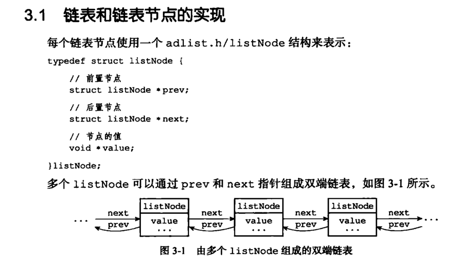
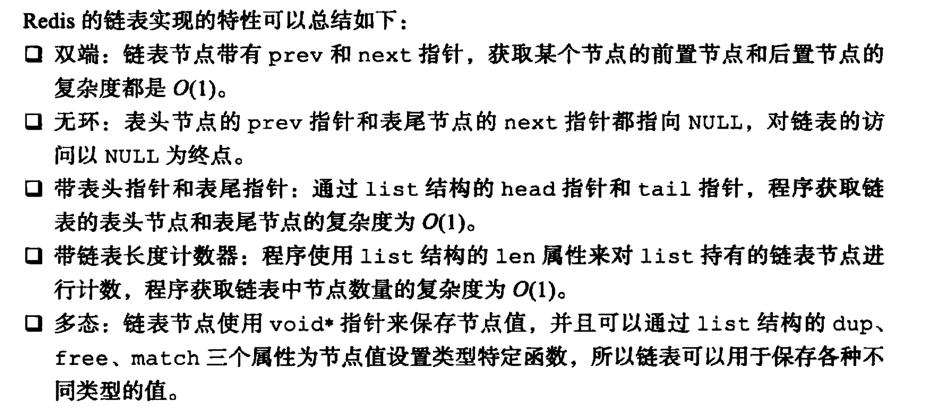

# 1. 主从复制

```shell
# 启动主从三个redis容器
docker run -it --name redis-6300 -d -p 6300:6379 redis redis-server
docker run -it --name redis-6380 -d -p 6380:6379 redis redis-server
docker run -it --name redis-6381 -d -p 6381:6379 redis redis-server

# 使用 docker inspect 查看主redis在docker中容器的内部IP
docker inspect redis-6300[容器名称或 id]

# 进入容器的内部，并配置从redis的主服务机ip和端口
docker exec -it redis-6300 bash
redis-cli
info replication

slaveof [172.17.0.6] 6300

# 配置哨兵
docker exec -it redis-6300 bash
cd /
apt-get update
apt-get install -y vim
vim sentinel.conf   -> sentinel monitor host6379 172.17.0.6 6379 1
redis-sentinel sentinel.conf
对三个redis容器都进行上述操作
```

# 2. 持久化

## 2.1. RDB

在的指定的时间间隔内，将内存中的数据以快照的方式存入磁盘，恢复时将快照文件直接读入到内存
redis会单独创建（fork）一个子进程来进行持久化(fork时会影响主进程作业)，会将数据暂时写入到一个临时文件中，待持久化的过程全部结束，将这个临时文件替换为新的.rdb文件。
整个过程中，主进程不进行任何IO操作，这就确保了Redis整体性能。
其配置在【SNAPSHOTTING】一栏中


- save 60 100 可以在停机时保存一次，也可以指定60秒达到1000次可以触发RDB

## 2.2. AOF

以日志的形式来记录每个写操作，将redis执行过的所有写指令保存，只是追加文件而不是改写文件，
redis启动时会加载这个.aof文件重新构建数据。为避免.aof文件累加过大，redis会以重写的形式来更新.aof文件的版本，保持数据的
其配置中【APPEND ONLY MODE】一栏中


### 2.2.1. fork

是将当前进程复制出一个一模一样的进程出来，包括当前进程的变量、程序计算器、上下文环境，这个全新的进程作为当前进程的子进程。

# 3. 数据类型

## 3.1. redis中的key

- keys * ：列出当前库中所有的key
- exists 为：判断key_name是否存在
- expire key_name [s]：给key_name设置过期时间
- ttl key_name：查看还有多少秒过期 -1表示永不过期、-2表示已过期、0表示正在计时
- type key_name：查看key_name的类型

## 3.2. String

- set/get/del/append/strlen
- incr/decr/incrby/decrby :后者是按步增长、减少
- getrange/setrange
- setex(set with expire)：
- setnx(set if not exists)
- mset/mget/msetnx
- getset

## 3.3. List

### 定义


### 特性


- 基于List的消息队列的优劣：
    - 可以满足消息的有序性
    - 无法避免消息丢失
    - 只能单消费者

## 3.4. Set

- sadd/smembers/sismenber
- scard 获取集合里面的元素个数
- srem key value：删除集合中的元素
- srandmember key [int] 随机选取几个元素
- spop key ：随机出栈
- smove key1 key2：将key1的值赋予key2
- sdiff\sinter\sunion：差集、交集、并集

## 3.5. Zset

- zadd/zrange
- zrangebyscore key [开始的分数] [结束的分数]
- zrem key 删除元素
- zcard/zcount key score区间/zrank key vlaues ：
- zrevrank key values ：逆序获得下标值
- zrevrange
- zrevrangebyscore key [开始的分数] [结束的分数]

## 3.6. Hash

- hset/hget/hmset/hmget/hgetall/hdel
- hlen
- hexists key
- hkeys/hvals
- hincrby/hincbyfloat
- hsetnx

# 4. 缓存问题

- https://cloud.tencent.com/developer/article/1525256

## 4.1. 穿透

一直访问不存在的一个值，如id=-1，缓存中没有，DB中也没有。所以一直在消耗IO资源。

### 4.1.1. 应对方法

- 入口加判断，如非法的参数拦截
- 将这类请求作为key，缓存起来,可以设置TTL时间
- 使用布隆过滤器，判断一个key是否已经查过了，如果已经查过了，就不去数据库查询。

## 4.2. 击穿

某个key,在特定时刻被大规模访问，过期后，后续的流量全部落到了DB上。

### 4.2.1. 应对方法

- 对于热点数据，慎重考虑过期时间，确保热点期间key不会过期，甚至有些可以设置永不过期。
- 基于逻辑过期应对击穿问题，写入redis时，不指定过期时间，在数据中添加过期时间，以数据中过期时间为准
- 使用互斥锁（比如Java的多线程锁机制），第一个线程访问key的时候就锁住，等查询数据库返回后，把值插入到缓存后再释放锁，这样后面的请求就可以直接取缓存里面的数据了。

## 4.3. 雪崩

缓存雪崩指的是，在某一时刻，多个key失效。这样就会有大量的请求从缓存中获取不到值，全部到数据库。还有另一种情况，就是缓存服务器宕机，也算做缓存雪崩。

### 4.3.1. 应对方法

- 对每个key的过期时间设置一个随机值，而不是所有key都相同。
- 热点数据永不过期
- 使用高可用的分布式缓存集群，确保缓存的高可用性，比如redis-cluster。

## 4.4. 踩踏

当多个线程试图并行访问缓存时，就会发生缓存踩踏。如果缓存的值不存在，那么线程将同时尝试从数据源获取数据。数据源通常是数据库，也可以是
Web 服务器、第三方 API 或任何其他可以返回数据的东西。
缓存踩踏之所以极具破坏性，一个主要原因是它会导致恶性的失败循环：

1. 大量的并发线程无法从缓存中获得数据，然后直接调用数据库。
2. 数据库由于巨大的 CPU 峰值发生崩溃，并导致超时错误。
3. 收到超时错误后，所有的线程都会发起重试，从而导致另一次踩踏。
4. 这个循环不断持续。
    - https://www.infoq.cn/article/Bb2YC0yHVSz4qVwdgZmO

# 5. 应用场景

## 5.1. session 短信登陆

## 5.2. 商品信息缓存

## 5.3. 优惠秒杀：计时器、LUA脚本、分布式锁、redis消息队列

## 5.4. 附近的商户：GeoHash

Geo使用的Zset的基础能力
附近的人，附近的车

## 5.5. UV统计：HyperLogLog

## 5.6. 用户签到、圈选：BitMAP

基于String的能力

## 5.7. 好友关注：Set 交集、差集

## 5.8. 达人探店：SortSet的点赞排行榜

- 某个评论是否被用户（去重）点赞过
  使用Set来记录某个评论是否被点赞过
- 点赞排行榜
  以时间戳作为SortedSet的分数，来保存点赞的用户的信息

# 6. 问题讨论

## 6.1. 删除缓存还是更新缓存

- ~~更新缓存~~：每次更新数据库时都更新缓存，无效写过多
- 删除缓存：让缓存失效，查询时再重新加载新的信息到缓存中

## 6.2. 缓存与DB一致性

- 单体系统：放在同一事务中
- 分布式系统：使用TCC分布式事务

## 6.3. 先操作缓存，还是先操作DB

- 先删除缓存，再删除DB，并发时（一个线程查询、一个线程删除）会存在不一致的情况

```text
如果有 2 个线程要并发「读写」数据，可能会发生以下场景：

线程 A 要更新 X = 2（原值 X = 1）
线程 A 先删除缓存
线程 B 读缓存，发现不存在，从数据库中读取到旧值（X = 1）
线程 A 将新值写入数据库（X = 2）
线程 B 将旧值写入缓存（X = 1）
最终 X 的值在缓存中是 1（旧值），在数据库中是 2（新值），发生不一致。

可见，先删除缓存，后更新数据库，当发生「读+写」并发时，还是存在数据不一致的情况。
```

- 先删除DB，再删除缓存，并发时（一个线程查询、一个线程删除）会存在不一致的情况，但比前者的概率低，因为DB的时间比缓存的操作时间长

```text
依旧是 2 个线程并发「读写」数据：

缓存中 X 不存在（数据库 X = 1）
线程 A 读取数据库，得到旧值（X = 1）
线程 B 更新数据库（X = 2)
线程 B 删除缓存
线程 A 将旧值写入缓存（X = 1）
最终 X 的值在缓存中是 1（旧值），在数据库中是 2（新值），也发生不一致。


```

## 6.4. 读写分离 + 主从复制延迟

```text
如果使用「先更新数据库，再删除缓存」方案，其实也发生不一致：

线程 A 更新主库 X = 2（原值 X = 1）
线程 A 删除缓存
线程 B 查询缓存，没有命中，查询「从库」得到旧值（从库 X = 1）
从库「同步」完成（主从库 X = 2）
线程 B 将「旧值」写入缓存（X = 1）
最终 X 的值在缓存中是 1（旧值），在主从库中是 2（新值），也发生不一致。

问题的核心在于：缓存都被回种了「旧值」。
```
最有效的办法就是，把缓存删掉,但是，不能立即删，而是需要「延迟删」，这就是业界给出的方案：缓存延迟双删策略。
这个「延迟删除」缓存，延迟时间到底设置要多久呢？

- 延迟时间要大于「主从复制」的延迟时间
- 延迟时间要大于线程 B 读取数据库 + 写入缓存的时间

凭借经验大致估算这个延迟时间，例如延迟 1-5s，只能尽可能地降低不一致的概率。
所以你看，采用这种方案，也只是尽可能保证一致性而已，极端情况下，还是有可能发生不一致。


## 6.5. 乐观锁应对库存超卖问题

- 用户A读取出是100件，更新库存时添加查询条件 **where quantity=100**

## 6.6. 一人一单（单机）

- 因为要insert,所以要使用悲观锁来应对这个问题
- 这个悲观锁可以使用UserID，如

```shell
synchronized(userId.toString().intern)
```

- 悲观锁的释放应该在事务的提交后，不然事务未提交锁已释放，第2个线程读取的未提交事务前的数据，即第1个线程读取的数据
- 注意事务失效的情况


## 6.7. 一人单（集群）

NX是互斥，EX是超时

- SET lock UUID EX 10 NX
- 锁超时自动释放后，他人获取了锁，自己释放锁时，判断UUID是不是自己的，不是自己的就不释放，避免删除他人持有的锁
- 自己释放锁时，判断UUID是自己的，释放锁前，阻塞了（JVM FGC），此时锁超时自动释放，他人获取了锁，还是会导致误删

> 判断锁和释放锁需要是原子性的，可以通过LUA脚本来处理

 
 