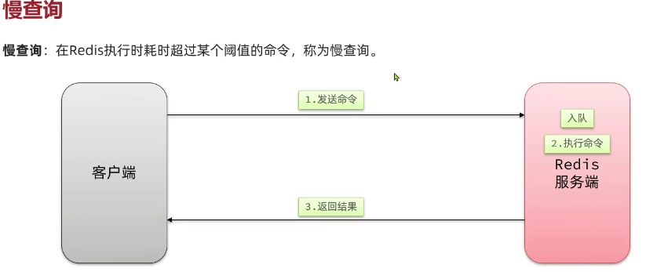

图片来源：https://www.bilibili.com/video/BV1cr4y1671t?p=160&vd_source=f52d9488d7d3c21ed33580e4dce1a022

 # KEY设计
- 业务名称：数据名：ID  login：user：10
- 长度不超过44字节，因为KEY是由STRING保存的，STRING底层编码有INT，EMBSTR，RAW三种，EMBSTR在小于44字节时使用，采用连续内存，内存使用小

# 不使用BIG KEY
- 单个KEY的VALUE小于10KB
- 对于集合类型的KEY，建议元素数量小于1000

## BIG KEY的问题
- 网络阻塞：BIG KEY 在少量的QPS也会占用大量网络带宽
- 数据倾斜：BIG KEY 使用内存比其他kEY要多很多，无法合理的均衡内存资源分配
- REDIS主线程阻塞：HASH、LIST、SET等运算会耗时
- 反序列化、序列化会使CPU使用率攀升

## 合适的数据结构

 
 一种应对方式：分片，可以把ID%100，就可以拆分

# 持久化配置

# 慢查询

 