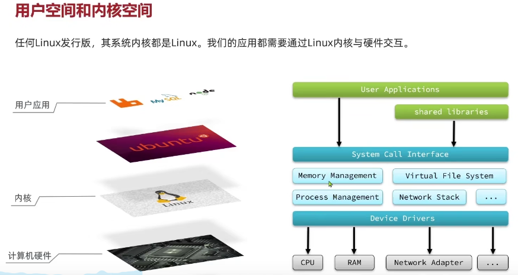
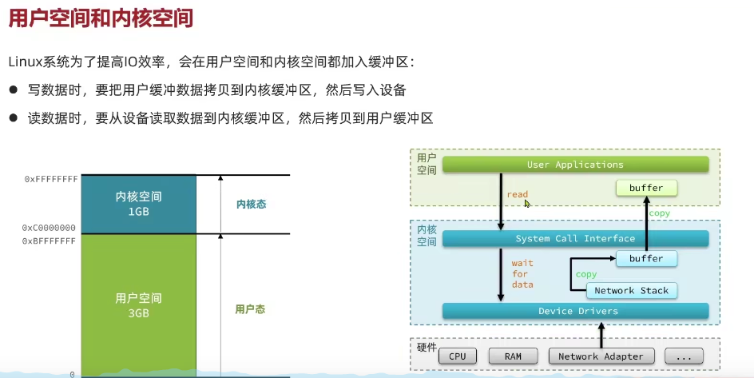
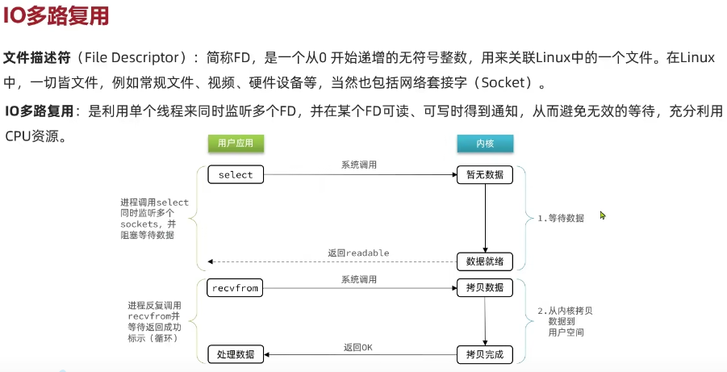
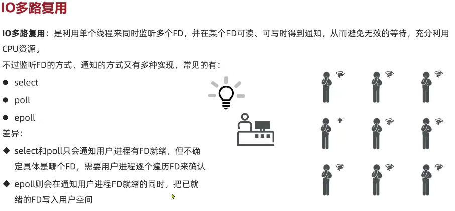
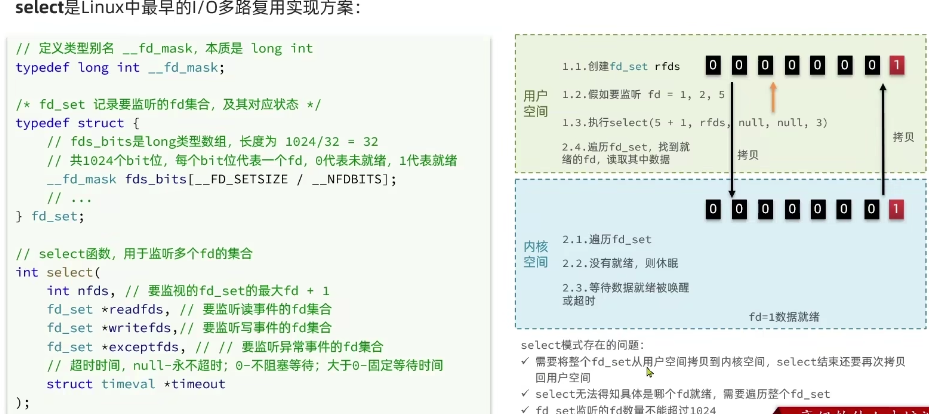
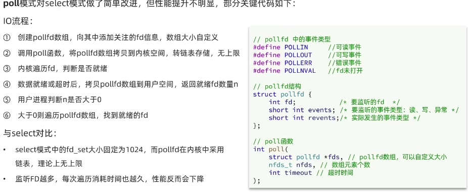
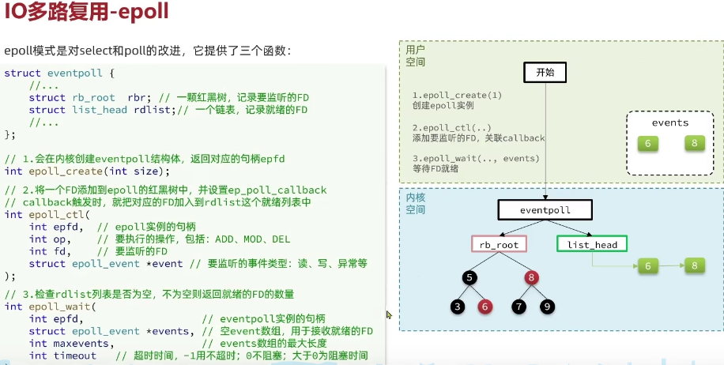

图片来源：https://www.bilibili.com/video/BV1cr4y1671t?p=160&vd_source=f52d9488d7d3c21ed33580e4dce1a022

# 用户空间与内核空间

# 阻塞IO

# 非阻塞IO

# IO多路复用

## select

## poll

## epoll

解决的问题：

- 使用红黑树保存要监听的FD
- 只拷贝一次FD到内核空间
- 内核将就绪的FD直接拷贝到用户空间，不再用户空间自己去遍历出哪个FD是就绪的

