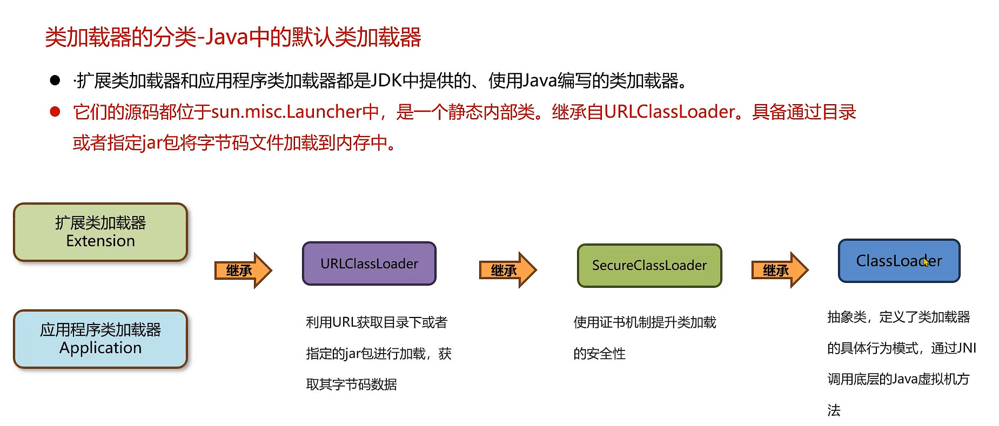
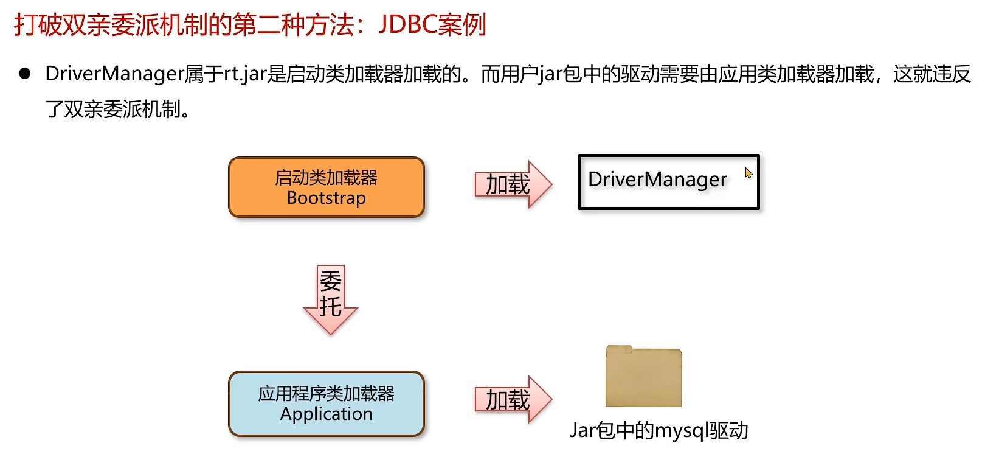
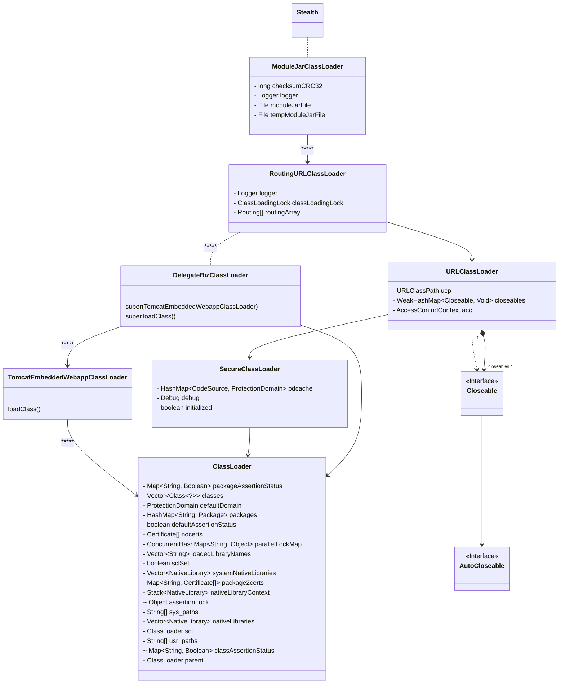

# 1. 类加载器

从java.lang.ClassLoader类的源代码中的注释可以知悉以下几个要点：

- 给出类的二进制名，类加载器可以加载、生成类的定义
- 第个类都一个加载它的类加载器
- 数组类不是由类加载器创建，它的类加载器和它的元素类是同一个
- 类加载通过双亲委派机制来搜索类和资源
- 每个类加载器都有对应的父类（也是一个类加载器）
- JVM中有一个 bootstrap class loader，是所有器加载器的父类
- 可以通过ClassLoader.registerAsParallelCapable来并行加载
- 双亲委派不是强制的，所以类加载需要具备并行能力，否则会出现死锁

## 1.1. 主要类加载器



```text
[arthas@56]$ classloader -t
+-BootstrapClassLoader
+-sun.misc.Launcher$ExtClassLoader@1806bc4c
+-com.taobao.arthas.agent.ArthasClassloader@70dbccd0
| +-com.alibaba.arthas.deps.com.alibaba.fastjson.util.ASMClassLoader@65a9e522
| +-com.alibaba.arthas.deps.com.alibaba.fastjson.util.ASMClassLoader@366d37d5
+-sun.misc.Launcher$AppClassLoader@18b4aac2
+-SandboxClassLoader[namespace=default;path=/opt/sandbox/lib/sandbox-core.jar;]
+-ModuleJarClassLoader[crc32=1008466651;file=/opt/sandbox/sandbox-module/repeater/repeater-module.jar;]
| +-com.alibaba.fastjson.util.ASMClassLoader@12a9ccaf
| +-com.alibaba.fastjson.util.ASMClassLoader@79f0e083
| +-com.alibaba.jvm.sandbox.repeater.module.classloader.PluginClassLoader@7ac8c463
+-ModuleJarClassLoader[crc32=705482150;file=/opt/sandbox/module/sandbox-mgr-module.jar;]
+-ModuleJarClassLoader[crc32=2819737704;file=/opt/sandbox/sandbox-module/tracking/tracking-module.jar;]
| +-com.frxs.foundation.tracking.module.classload.TrackingModuleClassLoader@7a356a0d
| +-com.alibaba.fastjson.util.ASMClassLoader@3bad566f
| +-com.frxs.foundation.tracking.module.classload.PluginClassLoader@38c9648e
| +-com.frxs.foundation.tracking.module.classload.PluginClassLoader@4d6f623d
+-com.alibaba.jvm.sandbox.core.classloader.ProviderClassLoader@524f3b3a
+-io.prometheus.jmx.shaded.net.bytebuddy.utility.dispatcher.JavaDispatcher$DynamicClassLoader@4034c28c
+-org.springframework.boot.loader.LaunchedURLClassLoader@3289079a
| +-com.alibaba.fastjson.util.ASMClassLoader@53f86cc3
| +-com.alibaba.fastjson.util.ASMClassLoader@19e2db7c
| +-java.net.URLClassLoader@6d4c18b8
```

### 1.1.1. Bootstrap Class Loader

主要用来加载 JDK 内部的核心类库（ %JAVA_HOME%/lib目录下的 rt.jar、resources.jar、charsets.jar等 jar 包和类）以及被
-Xbootclasspath参数指定的路径下的所有类

### 1.1.2. Extension Class Loader

加载 %JRE_HOME%/lib/ext 目录下的 jar 包和类以及被 java.ext.dirs 系统变量所指定的路径下的所有类。

### 1.1.3. System Class loader

面向我们用户的加载器，负责加载当前应用 classpath 下的所有 jar 包和类。

## 1.2. 双亲委派机制

### 1.2.1. 作用：

- 保存类加载的安全类
- 避免重复的类

### 1.2.2. 过程

- 向上搜索是否加载过
- 向下委派去加载（不在我的目录中，让子类去加载）

```text
protected Class<?> loadClass(String name, boolean resolve)
        throws ClassNotFoundException
    {
    // 上锁
        synchronized (getClassLoadingLock(name)) {
    // 先查询一次
            Class<?> c = findLoadedClass(name);
            if (c == null) {
                long t0 = System.nanoTime();
                try {
                    if (parent != null) {
                        // 由父类去查找
                        c = parent.loadClass(name, false);
                    } else {
                        // 使用bootstrap去查询
                        c = findBootstrapClassOrNull(name);
                    }
                } catch (ClassNotFoundException e) {
                    // ClassNotFoundException thrown if class not found
                    // from the non-null parent class loader
                }

                if (c == null) {
                    // 使用父类和bootstrap还是没有找到，使用findClass去查找
                    long t1 = System.nanoTime();
                    c = findClass(name); // 此方法中存在一个defineClass()方法，此方法会检查类文件是否合法，如自定义一个java.lang.String会检查有错误

                    //记录类加载的信息
                    sun.misc.PerfCounter.getParentDelegationTime().addTime(t1 - t0);
                    sun.misc.PerfCounter.getFindClassTime().addElapsedTimeFrom(t1);
                    sun.misc.PerfCounter.getFindClasses().increment();
                }
            }
            if (resolve) {
            // 解析类，是类的连接阶段工作
                resolveClass(c);
            }
            return c;
        }
    }
```

## 1.3. 指定类加载器加载哪些类

以jvm-sandbox-repeater自定义的类加载器为例，

```text
    public JarFileLifeCycleManager(String jarFilePath, PluginClassLoader.Routing ... routingArray) {
        File file = new File(jarFilePath);
        if (!file.exists()) {
            throw new IllegalArgumentException("jar file does not exist, path=" + jarFilePath);
        }
        final URL[] urLs = getURLs(jarFilePath);
        if (urLs.length == 0) {
            throw new IllegalArgumentException("does not have any available jar in path:" + jarFilePath);
        }
        // 在new一个类加载器时，传递了具体多个jar包的URL
        this.classLoader = new PluginClassLoader(getURLs(jarFilePath), this.getClass().getClassLoader(), routingArray);
    }
```

在RepeaterModule中调用上面的方法

```java
ApplicationModel.instance().setConfig(config);
 // 特殊路由表;
 PluginClassLoader.Routing[] routingArray = PluginClassRouting.wellKnownRouting(configInfo.getMode() == Mode.AGENT, 20L);
 String pluginsPath;
 if (StringUtils.isEmpty(config.getPluginsPath())) {
     pluginsPath = PathUtils.getPluginPath();
 } else {
     pluginsPath = config.getPluginsPath();
 }
 lifecycleManager = new JarFileLifeCycleManager(pluginsPath, routingArray);
 //
```

## 1.4. 使用线程上下文打破双亲委派机制



```java
    java.security.AccessController#doPrivileged(java.security.PrivilegedAction<T>)
    static {
        loadInitialDrivers();
        println("JDBC DriverManager initialized");
    }
    
    java.util.ServiceLoader#load(java.lang.Class<S>)
    public static <S> ServiceLoader<S> load(Class<S> service) {
        // 使用应用程序类加载器来加载驱动程序
        // 可以手工设置当前的线程上下文的类加载器  Thread.currentThread().setContextClassLoader();
        ClassLoader cl = Thread.currentThread().getContextClassLoader();
        return ServiceLoader.load(service, cl);
    }
```

## 1.5. 问题讨论

### 1.5.1. 如何加载一个类

从上面的逻辑可以看到，加载的方使用loadClass(),但过程先是使用父类加载，没有加载到，再使用findClass()去查找，所以加载一个类，

- 如果要遵从委派机制，可以只重写findClass()方法，
- 如果是要破坏委派机制，是直接重写loadClass()方法。
  使用以下方法进行加载

```text
    @Override
    protected synchronized Class<?> loadClass(String name, boolean resolve) 
```

### 1.5.2. 判定一个类是否被加载

使用findLoadedClass方法

```text
final Class<?> loadedClass = findLoadedClass(name);
```

### 1.5.3. 等待一个类加载完成

参加sandbox-repeater的实现，

```text
while (isPreloading && --timeout > 0 && ClassloaderBridge.instance().findClassInstances(routing.targetClass).size() == 0) {
    try {
        Thread.sleep(100);
        LogUtil.info("{} required {} class router,waiting for class loading", routing.identity, routing.targetClass);
    } catch (InterruptedException e) {
        // ignore
    }
}
```

### 1.5.4. 重复的类，谁优先加载

启动类加载器，优先级最高，即BootstrapClassLoader

### 1.5.5. 类的桥接



在jvm-sandbox中，希望在沙箱中的代码可以直接调用业务代码中的类。但双方是不同的类
加载器，所以在沙箱加载中，可以使用业务代码的类代码器，如Spring的LauncherURLClassLoader去
加载类，如上图中，****线的关联关系。

- DelegateBizClassLoader delegateBizClassLoader = BusinessClassLoaderHolder.getBussinessClassLoader();

下面的代码中，
```java
@Override
    protected Class<?> loadClass(final String javaClassName, final boolean resolve) throws ClassNotFoundException {
        synchronized (getClassLoadingLock0(javaClassName)){
            // 优先查询类加载路由表,如果命中路由规则,则优先从路由表中的ClassLoader完成类加载
            if (ArrayUtils.isNotEmpty(routingArray)) {
                for (final Routing routing : routingArray) {
                    if (!routing.isHit(javaClassName)) {
                        continue;
                    }
                    final ClassLoader routingClassLoader = routing.classLoader;
                    try {
                        return routingClassLoader.loadClass(javaClassName);
                    } catch (Exception cause) {
                        // 如果在当前routingClassLoader中找不到应该优先加载的类(应该不可能，但不排除有就是故意命名成同名类)
                        // 此时应该忽略异常，继续往下加载
                        // ignore...
                    }
                }
            }

            // 先走一次已加载类的缓存，如果没有命中，则继续往下加载
            final Class<?> loadedClass = findLoadedClass(javaClassName);
            if (loadedClass != null) {
                return loadedClass;
            }

            try {
                Class<?> aClass = findClass(javaClassName);
                if (resolve) {
                    resolveClass(aClass);
                }
                return aClass;
            } catch (Exception cause) {
                DelegateBizClassLoader delegateBizClassLoader = BusinessClassLoaderHolder.getBussinessClassLoader();
                try {
                    if(null != delegateBizClassLoader){
                        return delegateBizClassLoader.loadClass(javaClassName,resolve);
                    }
                } catch (Exception e) {
                    //忽略异常，继续往下加载
                }
                return RoutingURLClassLoader.super.loadClass(javaClassName, resolve);
            }
        }
    }
```

# 2. jdk9的类加载器
- 启动类加载器，使用java编码，在jdk.

# Internal Name
在 .java 文件中，我们使用 Java 语言来编写代码，使用类名的形式是Fully Qualified Class Name，例如 java.lang.String；将 .java 文件编译之后，就会生成 .class 文件；在 .class 文件中，类名的形式会发生变化，称之为Internal Name，例如 java/lang/String。因此，将Fully Qualified Class Name转换成Internal Name的方式就是，将 . 字符转换成 / 字符。

# 3. 参考文献

- https://www.baeldung.com/java-classloaders