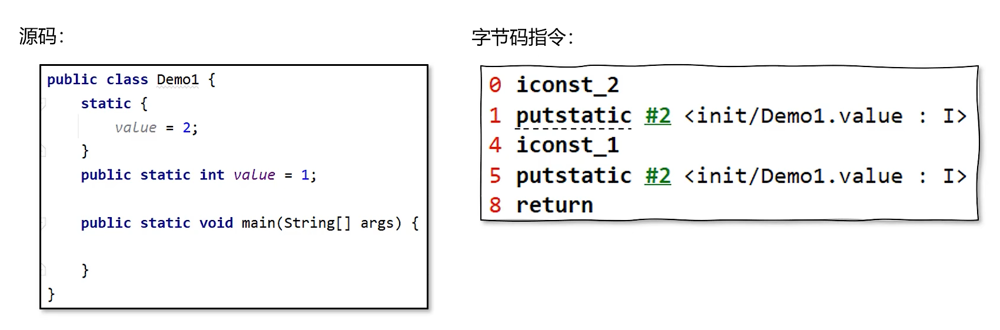
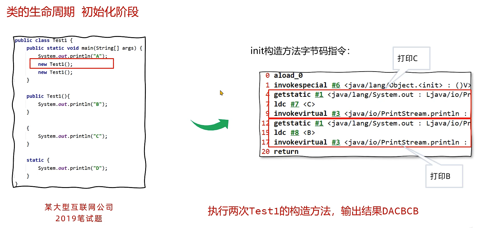

# 1. jvm作用

## 1.1. 解释与执行

.java >(javac)> .class>(java -jar)>jvm

将字节码中指令，实时解释成机器码，让计算机执行

```shell
javap 命令查看类的字节码
javap java.lang.Object
javap -v java.lang.Object #verbose 
javap -c java.lang.Object #compile

```

## 1.2. 内存管理与垃圾回收

堆、栈、程序计数器、方法区、

## 1.3. 即时编译（just-in-time JIT ）

对热点代码进优化：将热点字节码，解释并优化为汇编和机器码，保存在内存中，再次执行时，直接从内存调用。

# 2. 常用的虚拟机

- HotSpot
- EclipseJDK
- GraalVM 大数据和云原生场景下诞生
- DragonWall

# 3. 类的生命周期

加载、连接（验证、准备、解析）、初始化、使用、卸载 。初始化这个阶段，可以被干涉。

## 3.1. 加载

使用类加载器，根据类的全限定名，通过不同渠道以二进制方式，加载到内存（方法区和堆区都会创建一个类信息，静态属性是在堆中，方法区，不同的虚拟机，方法区放在不同的位置）。

- 不同的渠道包括本地文件，网络传输的类，动态代理生成（Spring）的类。


jdk8之后，静态字段保存在堆区，不在方法区

hsdb工具查询jvm内存信息：java -cp sa-jdi.jar sun.jvm.hotspot.HSDB

## 3.2. 连接

### 3.2.1. 验证

验证是否符合jvm规范

- 文件格式验证，是否以0xCAFEBABE开头
- 元信息验证，如必须有父类
- 字节码指令主是否正确
- 引用验证，如private的方法或字段不能引用

### 3.2.2. 准备

给静态变量分配内存（在堆区），赋初始值，如public static int i=1，在此阶段是0，不是1；但是final修饰的话，就是1

### 3.2.3. 解析

将常量池中的符号引用，替换成直接引用（即内存中的地址）

## 3.3. 初始化阶段
- 执行静态代码块，为静态变量赋值,静态代码块和静态变量值的赋值顺序与代码的先后顺序一致


### 3.3.1. <init>() 和 <clinit>() 方法

对于一个类（Class）来说，如果没有提供任何构造方法，Java 编译器会自动生成一个默认构造方法。在所有的 .class 文件中，构造方法的名字是 <init>()。
另外，如果在 .class 文件中包含静态代码块，那么就会有一个 <clinit>() 方法。


### 3.3.2. 以下几种方式会引发初始化：
- 访问一个类的静态变量或静态方法（final修饰过的字段或方法，是在连接阶段初始化了）【优先级最高】
- 调用Class.forName(String className)
- new 一个类
- main执行方法所在的类



> -XX:TraceClassLoading 参数可以打印出加载并初始化的类

### 3.3.3. 以下几种情况不会进行初始化指令（clinit）的执行
- 无静态代码块且无静态变量赋值语句
- 有静态变量的声明，但是没有赋值
- 静态变量定义成final
- 数组的初始化是不会引发初始化