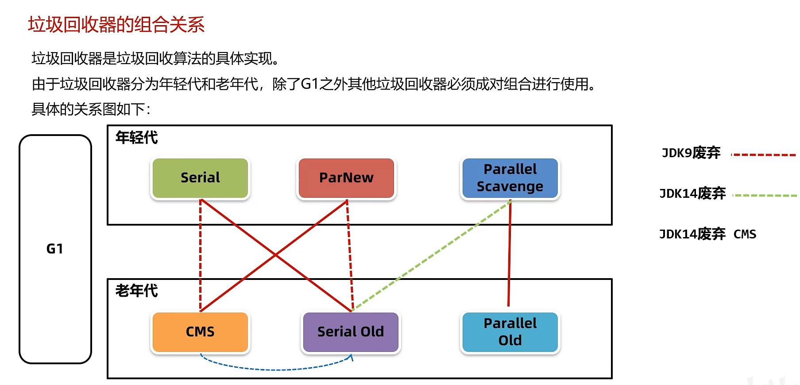
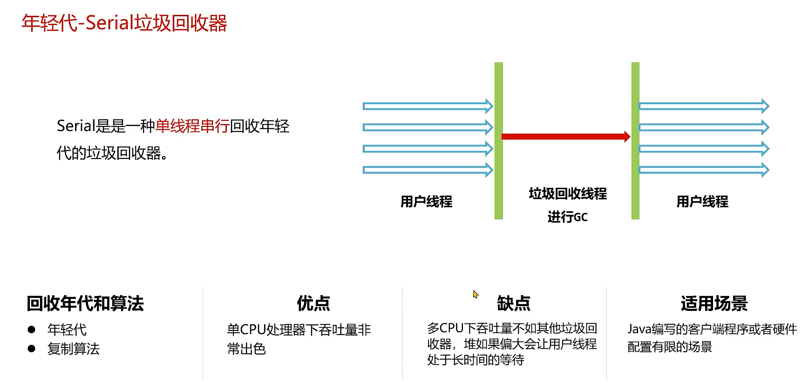
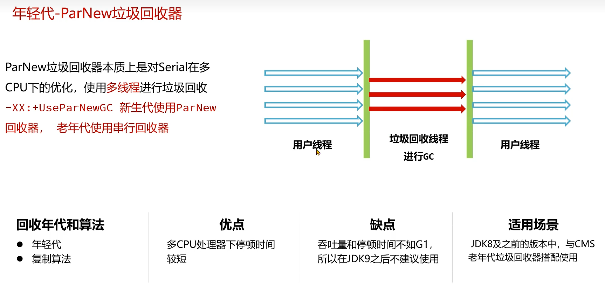
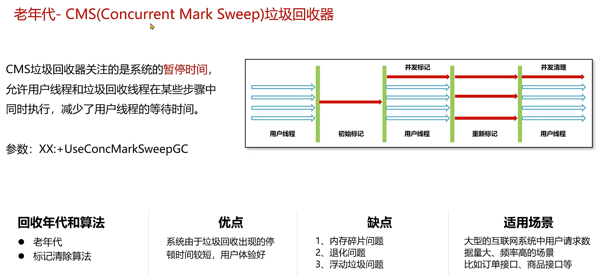
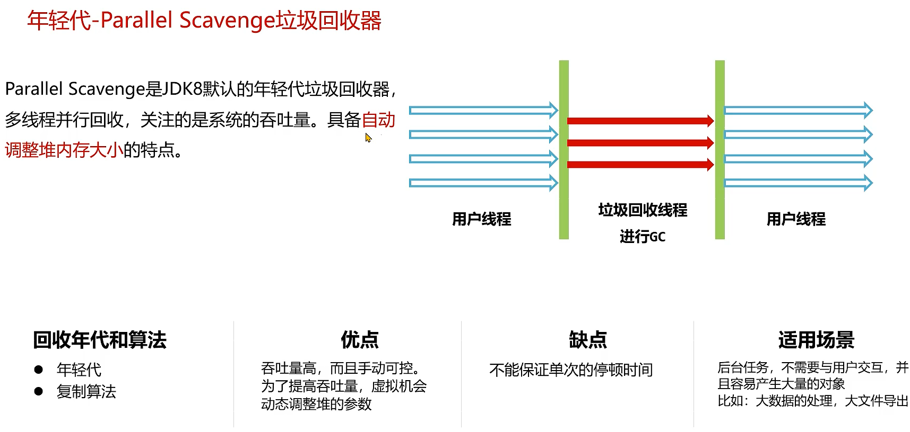

# 1. 方法区

关注类的信息，如何被回收，3个条件：

- 1 类的所有实例，及子类实例被回收
- 2 类的加载器被回收
- 3 Class对象没有被任何数据引用

每个jps文件都有一个唯一的类加载器。

# 2. 堆

> JVM堆是Java堆内存，它是Java堆中对象分配的空间。
> JVM堆的大小由最大堆大小（-Xmx）和初始堆大小（-Xms）参数控制。
> JVM堆的默认大小取决于JDK版本和操作系统。在某些JDK版本中，
> JVM堆的默认最大堆大小为1GB，初始堆大小为物理内存的1/64。

## 2.1. 引用计数与可达性分析

- 引用计数在循环引用时，会出现无法回收的情况

### 2.1.1. 可达性分析

根对象与普通对象，与根对象没有关联时，就被回收

- 线程Thread对象，引用栈帧中方法参数、局部变量等
- 系统类加载器的java.lang.Class对象（某个类的元信息）
- 监视器对象，synchronized持有的对象
- 本地方法调用时使用的全局对象

# 3. 引用

- 软引用：常用于缓存中，当内存不足时，使用软引用 SoftReference，回收可以放在一个软引用队列中，ReferenceQueue
- 虚引用：不能通过引用去获取使用的对象，唯一用途是内存释放时，可以收到一个通知。PhantomReference
- 弱引用：不管GC时内存够不够，都会被回收，WeakReference，一般用于ThreadLocal中
- 终结引用：对象需要被回收时，会将关联的对象放在一个finalize队列中，第二次回收时，才会真正回收，但是真正回收前
  ，可以关联对象再关联对一个强引用，又不会回收。

# 4. 垃圾回收算法

垃圾回收主要做两件事：标识是否被回收； 回收内存，释放空间。

GC线程进行垃圾回收，会影响到用户线程，会存在 **STW（Stop The World）** 时间。

可以从最大暂停时间、吞吐量、堆使用效率等方面考查垃圾回收算法的优劣。

## 4.1. 标记-清除 Mark-Sweep GC

标记阶段：用可达性分析找到存在对象
清除阶段：将不可达的对象回收

- 优点：实现简单
- 缺点：
    - 内存碎片多
    - 分配速度慢，因为碎片多，在分配新内存时，要遍历所有碎片，找出合适的空闲内存

## 4.2. 复制 Copy GC

将堆分为From和To空间
GC开始，将GC root对象复制到To空间
把GC root关联的对象复制到To空间
From中剩下的数据，就是要被清除的

- 优点：吞吐量高，没有过大的碎片
- 缺点：内存使用率不高，只有一半的空间可以用来创建新对象

## 4.3. 标记-整理 Mark-Compact GC
标记阶段：用可达性分析找到存在对象
整理阶段：将存活对象整理到堆的一端，清理出存在对象原来的空间。

- 优点：内存使用率高，没有碎片
- 缺点：对堆中的对象搜索2次，效率不高

## 4.4. 分代GC Generate GC
将堆分为老年代与年轻化，年轻化分布Eden区和Survivor1、Survivor2区，年轻代比例8：1：1。

年轻代存放使用时间短的对象，比如每次创建订单的订单明细数据

老年代存入使用时间长的对象。比如Spring中的Bean

- YGC 将年轻代的数据，GC次数达到15次，会被移入老年代
- FGC 整个堆回收

# 5. 垃圾回收器

## 5.1. 年轻代-Serial

## 5.2. 年轻代-ParNew

## 5.3. 老年代-CMS

- 初始标记
- 并发标记
- 重新标记：并发标记后漏标、误标、，查漏补缺
- 并发清理

## 5.4. Parallel Scavenge

## 5.5. G1
- 分为Eden， Survivor， old
- 默认分为2048个区域

# jvm GC 配置

> -server -Xmx13G -Xms13G -Xss4M -XX:+UseG1GC -XX:MaxGCPauseMillis=100 -XX:+UseStringDeduplication
-XX:+DisableExplicitGC -XX:+ScavengeBeforeFullGC -XX:+ExplicitGCInvokesConcurrent -XX:+PrintGCDetails
-XX:+PrintGCDateStamps -XX:+PrintGCApplicationConcurrentTime -XX:+PrintHeapAtGC -XX:+HeapDumpOnOutOfMemoryError
-XX:HeapDumpPath=/root/logs/dump.bin -XX:ErrorFile=/root/logs/dump-error.log
-Xloggc:/root/logs/gc.log -XX:-OmitStackTraceInFastThrow -Dproject.name=xsyx-repeater-datasyn
-DappName=xsyx-repeater-datasyn -agentlib:jdwp=transport=dt_socket,server=y,suspend=n,address=5005  
-DinsightConsoleUrl=http://insight-console.cs-test.xsyxsc.cn

 - server 
 - Xmx13G 
 - Xms13G 
 - Xss4M 
 - XX:+UseG1GC 
 - XX:MaxGCPauseMillis=100 
 - XX:+UseStringDeduplication
 - XX:+DisableExplicitGC 
 - XX:+ScavengeBeforeFullGC 
 - XX:+ExplicitGCInvokesConcurrent 
 - XX:+PrintGCDetails
 - XX:+PrintGCDateStamps 
 - XX:+PrintGCApplicationConcurrentTime 
 - XX:+PrintHeapAtGC 
 - XX:+HeapDumpOnOutOfMemoryError
 - XX:HeapDumpPath=/root/logs/dump.bin 
 - XX:ErrorFile=/root/logs/dump-error.log
 - Xloggc:/root/logs/gc.log 
 - XX:-OmitStackTraceInFastThrow 
 - Dproject.name=good-test-man
 - DappName=good-test-man 
 - agentlib:jdwp=transport=dt_socket,server=y,suspend=n,address=5005  
