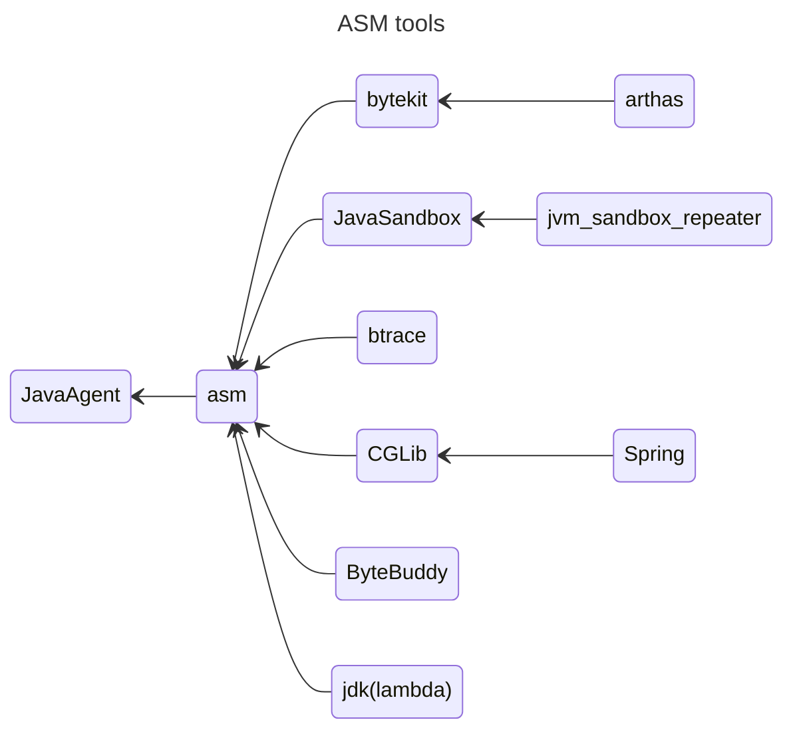

# 1. 常见框架


 


# 2. ASM

- https://asm.ow2.io/

```text
ASM is an all purpose Java bytecode manipulation and analysis framework. It can be used to modify existing classes or to dynamically generate classes, directly in binary form. ASM provides some common bytecode transformations and analysis algorithms from which custom complex transformations and code analysis tools can be built. ASM offers similar functionality as other Java bytecode frameworks, but is focused on performance. Because it was designed and implemented to be as small and as fast as possible, it is well suited for use in dynamic systems (but can of course be used in a static way too, e.g. in compilers).

ASM是一个通用的Java字节码操作和分析框架。它可用于修改现有类或直接以二进制形式动态生成类。ASM提供了一些通用的字节码转换和分析算法，
可以从这些算法中构建定制的复杂转换和代码分析工具。
ASM提供了与其他Java字节码框架类似的功能，但更注重性能。
因为它的设计和实现是尽可能的小和快，
所以它非常适合在动态系统中使用(当然也可以在静态方式中使用，例如在编译器中)。
```

> 「ASM」，是一个 Java 字节码操控框架。它能被用来动态生成类或者增强既有类的功能。
> ASM 可以直接产生二进制 class 文件，也可以在类被加载入 Java 虚拟机之前动态改变类行为。
> Java class 被存储在严格格式定义的 .class 文件里，这些类文件拥有足够的元数据来解析类中的所有元素：类名称、方法、属性以及
> Java 字节码（指令）。
> ASM 从类文件中读入信息后，能够改变类行为，分析类信息，甚至能够根据用户要求生成新类。说白了asm是直接通过字节码来修改class文件。
> 另外除了 ASM 可以操作字节码，还有javassist和Byte-code等，他们比 asm 要简单，但是执行效率还是 asm 高。因为 asm
> 是直接使用指令来控制字节码。

## 2.1. Asm两类API

ASM API基于访问者模式，为我们提供了ClassVisitor，MethodVisitor，FieldVisitor API接口，每当ASM扫描到类字段是会回调visitField方法，扫描到类方法是会回调MethodVisitor，下面我们看一下API接口


- Core Api
  - asm.jar
  - asm-util.jar 通用工具类
  - asm-commons.jar 具体场景的工具类
- Tree Api
  - asm-tree.jar
  - asm-analysis.jar

## 2.2. 使用Asm技术

如图所示，业界有许多的技术都使用ASM技术来实现一些提交的插件，主要目的不乏：
- 面向切面编程 Spring CGlib
- Jdk lambda 表达式，JDK使用 `jdk.internal.org.objectweb.asm.ClassWriter `来生成一个类，将 lambda 表达式的代码包装起来。

## 2.3. ASM 使用方式
- generate 从0到1写一个Class文件 
- transformer 从1到1 修改一个Class文件 
- analysis 代码扫描、分析 

## 2.4. Asm辅助命令
```shell
javac -g Test.java
javap -verbose Test.class
```

# 3. Java Agent 技术

> 「JavaAgent」，是一种探针技术可以通过 premain 方法，在**类加载**的过程中给指定的方法进行字节码增强。
> 其实你的每一个类最终都是字节码指令的执行，
> 而这种增强后的方法就可以输出我们想要的信息。
> 这就相当于你硬编码时候输出了一些方法的耗时，日志等信息。

## 3.1. 静态Agent

- 在jvm调用main方法前，使用premain方法启动的
- 需要使用java -jar --javaagent /opt/runtime/aaa.jar 的方式来指定agent包，以启动静态代理

```shell
-agentlib:<libname>[=<选项>] 加载本机代理库 <libname>, 例如 -agentlib:hprof
	另请参阅 -agentlib:jdwp=help 和 -agentlib:hprof=help
-agentpath:<pathname>[=<选项>]
	按完整路径名加载本机代理库
-javaagent:<jarpath>[=<选项>]
	加载 Java 编程语言代理, 请参阅 java.lang.instrument
```

## 3.2. 动态Agent

- 1.6之后，使用agentmain方法启动，在目标程序被加载后执行
- 使用attach的api来

## 3.3. 使用java agent技术时需要注意的问题

- 能解决jar包依赖冲突
- 处理类加载隔离问题
- 尽量保持agent轻量级
- 保证后续场景可扩展
- 保证业务方最低的接入集成成本

# 代码编写
```java
import org.objectweb.asm.*;  
  
public class DynamicClassGenerator {  
    public static void main(String[] args) throws Exception {  
        // 创建ClassWriter对象，生成类的字节码  
        ClassWriter cw = new ClassWriter(0);  
        cw.visit(Opcodes.V1_8, Opcodes.ACC_PUBLIC, "Dynamic/MyClass", null, "java/lang/Object", null);  
  
        // 创建MethodVisitor对象，生成构造方法  
        MethodVisitor constructor = cw.visitMethod(Opcodes.ACC_PUBLIC, "<init>", "()V", null, null);  
        constructor.visitVarInsn(Opcodes.ALOAD, 0);  
        constructor.visitMethodInsn(Opcodes.INVOKESPECIAL, "java/lang/Object", "<init>", "()V", false);  
        constructor.visitInsn(Opcodes.RETURN);  
        constructor.visitMaxs(1, 1);  
        constructor.visitEnd();  
  
        // 创建MethodVisitor对象，生成一个方法  
        MethodVisitor method = cw.visitMethod(Opcodes.ACC_PUBLIC, "myMethod", "()V", null, null);  
        method.visitFieldInsn(Opcodes.GETSTATIC, "java/lang/System", "out", "Ljava/io/PrintStream;");  
        method.visitLdcInsn("Hello from MyClass!");  
        method.visitMethodInsn(Opcodes.INVOKEVIRTUAL, "java/io/PrintStream", "println", "(Ljava/lang/String;)V", false);  
        method.visitInsn(Opcodes.RETURN);  
        method.visitMaxs(2, 1);  
        method.visitEnd();  
  
        // 创建FieldVisitor对象，生成一个静态字段  
        FieldVisitor field = cw.visitField(Opcodes.ACC_PUBLIC | Opcodes.ACC_STATIC, "myField", "I", null, null);  
        field.visitEnd();  
  
        // 完成类的生成  
        cw.visitEnd();  
  
        // 获取生成的类的字节码，并加载到类加载器中  
        byte[] bytes = cw.toByteArray();  
        URLClassLoader classLoader = URLClassLoader.newInstance(new URL[]{new File("").toURI().toURL()});  
        Class<?> myClass = ClassLoader.defineClass("Dynamic/MyClass", bytes);  
        myClass.getMethods()[0].invoke(null);  // 调用生成的myMethod方法，因为它是静态的，所以可以直接调用  
    }  
}
```
# 4. 参考文献

- https://www.baeldung.com/java-classloaders 类加载器
- https://tech.hipac.cn/archives/aeb6e3616cf74e1984b908fc1cd98913#jacoco 多agent治理在海拍客的应用与实践
- https://arthas.aliyun.com/doc/agent.html 通常 Arthas 是以动态 attach 的方式来诊断应用，但从3.2.0版本起，Arthas 支持直接以
  java agent 的方式启动。
- https://www.cnblogs.com/rickiyang/p/11368932.html agent代码精解
- https://juejin.cn/post/7018237356532563999 代码示例
- https://developer.aliyun.com/article/854428 代码示例
- https://zhuanlan.zhihu.com/p/448871215