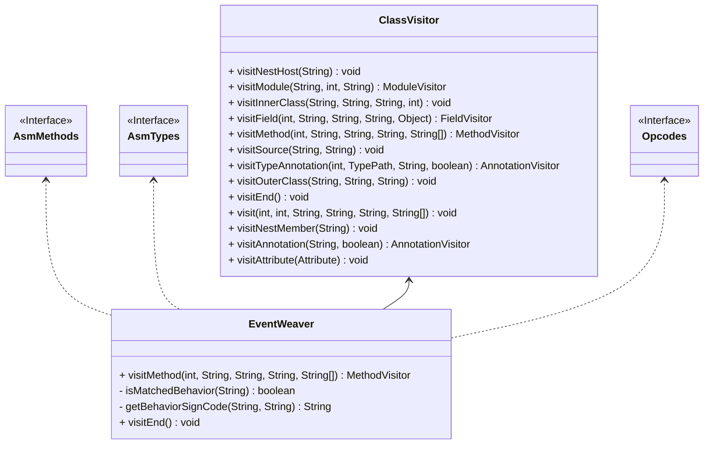
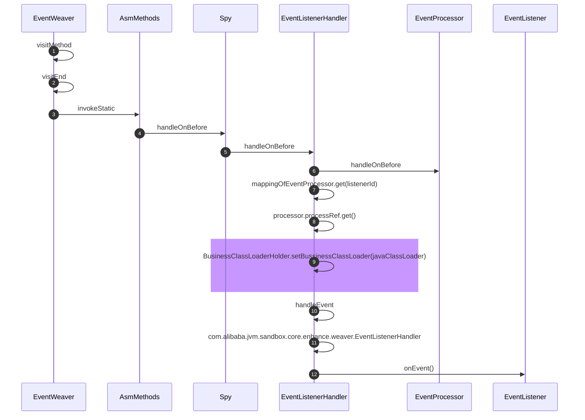

# 1. 包结构

## 1.1. sandbox-agent

### 1.1.1. SandboxClassLoader 类加载器，

构造函数中声明了sandboxCoreJarFilePath这个核心jar包的文件,用来隔离业务代码

### 1.1.2. AgentLauncher 代理的启用类

使用两种方式来启动agent，**LAUNCH_MODE_AGENT（启动加载）**，**LAUNCH_MODE_ATTACH（动态加载）**

- 会不会两个命令同时写一个文件，产生竞争，发生ABA？

```text

private static synchronized InetSocketAddress install(final Map<String, String> featureMap, final Instrumentation inst)
premain和attach两种方式都会调用这个方法，这个方法上的static锁。

```

**premain 方式**

- premain方式启动时，loadOrDefineClassLoader()会使用SandboxClassLoader来加载sandbox-core这个模块的jar文件，做到与工程代码的类加载器隔离
- inst.appendToBootstrapClassLoaderSearch(new JarFile(new File(getSandboxSpyJarPath(home)  将Spy注入到BootstrapClassLoader

**attach 方式**

## 1.2. sandbox-api

- 注解：命令注解、BootstrapClassLoader类加载注解、包含子类注解、不使用sandbox的加载类加载的注解
- 事件定义：定义了7件事件如，调用之前，调用之后，异常之后……
- 过滤器：对加载某些类时，是否匹配，是否使用BootstrapClassLoader类加载，是否包含子类 等，进行逻辑过滤
- 监听器：
    - 行为通知 Advice Attachment
    - 事件监听器 EventListener AdviceAdapterListener AdviceListener
- 资源
    - LoadedClassDataSource 已加载类数据源
    - ModuleController 模型控制接口
    - ModuleManager 模块管理
    - ModuleEventWatcher 事件观察
- SPI onJarUnLoadCompleted
- ModuleLifecycle 沙箱模块的生命周期 ModuleLifecycleAdapter
- ProcessController 流程控制 ProcessControlException

## 1.3. sandbox-common-api

- 沙箱的配置 ConfigInfo 如启用方式是Agent 还是 Attach

## 1.4. sandbox-core

- classloader 类加载器

### 1.4.1. asm

- CodeLock 代码锁
- EventWeaver 事件编织者,类图如下



**调用时序图**



## 1.5. sandbox-debug-module

- 调用模块，定义了许多module

## 1.6. sandbox-mgr-module

- ControlModule 沙箱控制模块
- InfoModule 沙箱信息模块
- ModuleMgrModule 沙箱管理模块 list flush reset unload frozen
- OnJarUnLoadCompleted SPI实现

## 1.7. sandbox-mgr-provider

- 对ModuleLoadingChain 和 ModuleJarLoadingChain 的空实现

## 1.8. sandbox-provider-api

- 模块加载链 ModuleLoadingChain
- 模块jar包文件加载链 ModuleJarLoadingChain

## 1.9. sandbox-spy

- 流程扭转中间类 SpyHandler Spy

```java
//Spy类的方法，其实是ASM增强后，调用的

public static void spyMethodOnCallThrows(final String throwException,
final String namespace,
final int listenerId)throws Throwable{
        try{
final SpyHandler spyHandler=namespaceSpyHandlerMap.get(namespace);
        if(null!=spyHandler){
        spyHandler.handleOnCallThrows(listenerId,throwException);
        }
        }catch(Throwable cause){
        handleException(cause);
        }
        }

        /**
         * asm method of {@link Spy#spyMethodOnCallThrows(String, String, int)}
         */
        Method ASM_METHOD_Spy$spyMethodOnCallThrows=getAsmMethod(
        Spy.class,
        "spyMethodOnCallThrows",
        String.class,String.class,int.class
    );
```

# 2. 源代码细节

## 2.1. 生命周期

```java
package com.alibaba.jvm.sandbox.api;

/**
 * 沙箱模块生命周期
 *
 * @author luanjia@taobao.com
 */
public interface ModuleLifecycle extends LoadCompleted {

    /**
     * 模块加载，模块开始加载之前调用！
     * <p>
     * 模块加载是模块生命周期的开始，在模块生命中期中有且只会调用一次。
     * 这里抛出异常将会是阻止模块被加载的唯一方式，如果模块判定加载失败，将会释放掉所有预申请的资源，模块也不会被沙箱所感知
     * </p>
     *
     * @throws Throwable 加载模块失败
     */
    void onLoad() throws Throwable;


    /**
     * 模块卸载，模块开始卸载之前调用！
     * <p>
     * 模块卸载是模块生命周期的结束，在模块生命中期中有且只会调用一次。
     * 这里抛出异常将会是阻止模块被卸载的唯一方式，如果模块判定卸载失败，将不会造成任何资源的提前关闭与释放，模块将能继续正常工作
     * </p>
     *
     * @throws Throwable 卸载模块失败
     */
    void onUnload() throws Throwable;

    /**
     * 模块激活
     * <p>
     * 模块被激活后，模块所增强的类将会被激活，所有{@link com.alibaba.jvm.sandbox.api.listener.EventListener}将开始收到对应的事件
     * </p>
     * <p>
     * 这里抛出异常将会是阻止模块被激活的唯一方式
     * </p>
     *
     * @throws Throwable 模块激活失败
     */
    void onActive() throws Throwable;

    /**
     * 模块冻结
     * <p>
     * 模块被冻结后，模块所持有的所有{@link com.alibaba.jvm.sandbox.api.listener.EventListener}将被静默，无法收到对应的事件。
     * 需要注意的是，模块冻结后虽然不再收到相关事件，但沙箱给对应类织入的增强代码仍然还在。
     * </p>
     * <p>
     * 这里抛出异常将会是阻止模块被冻结的唯一方式
     * </p>
     *
     * @throws Throwable 模块冻结失败
     */
    void onFrozen() throws Throwable;

}

```

## 2.2. JVMTI

- JVMTI（JVM Tool Interface）是 Java 虚拟机所提供的 native 编程接口，是 JVMPI（Java Virtual Machine Profiler Interface）和
  JVMDI（Java Virtual Machine Debug Interface）的替代版本。

> VMTI只是一套接口，我们要开发JVM工具就需要写一个Agent程序来使用这些接口。Agent程序其实就是一个C/C++语言编写的动态链接库。

## 2.3. JPLISAgent

## 2.4. 如何进行类隔离

- 对于同样的类，是不是会加载多次，比如LogFactory,业务代码中有一个，Sandbox自己也有一个

## 2.5. 同一个类被多个模块增强，字节码会是怎么样

## 2.6. 同一个类被多个模块同步增强，是否会出现ABA问题，如何应对这类问题

- 代码锁

## 2.7. 同一类被多个模块增强后，同步命中，多个事件是否存在顺序

## 2.8. 同一个类，在同一个模块，多次增强

# 3. 参考文献

1. https://www.baeldung.com/java-classloaders 类加载器
2. https://tech.hipac.cn/archives/aeb6e3616cf74e1984b908fc1cd98913#jacoco 多agent治理在海拍客的应用与实践
3. https://arthas.aliyun.com/doc/agent.html 通常 Arthas 是以动态 attach 的方式来诊断应用，但从3.2.0版本起，Arthas 支持直接以
   java agent 的方式启动。
4. https://www.cnblogs.com/rickiyang/p/11368932.html agent代码精解
5. https://juejin.cn/post/7018237356532563999 代码示例
6. https://developer.aliyun.com/article/854428 代码示例
7. https://zhuanlan.zhihu.com/p/448871215