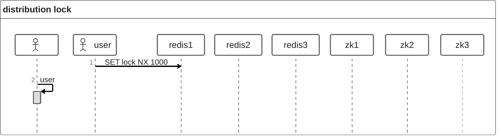

## redis 与 zookeeper

zookeeper更适合使用分布式锁的场景，因为是强一致性的分布式协议,redis集群是最终一致性

```mermaid

zenuml
    title distribution lock
    @Actor user
    @RDS redis1
    @RDS redis2
    @RDS redis3
    @S3 zk1
    @S3 zk2
    @S3 zk3
    user->redis1: SET lock NX 1000 
    user<--redis1: lock success
    redis1->redis2: SET lock NX 1000
    redis2->redis3: SET lock NX 1000
    
    
    user->zk1: SET lock NX 1000 
    zk1->zk2: SET lock NX 1000
    zk2->zk3: SET lock NX 1000
    user<--zk1: lock success
    

```

- zk 会在集群中所有节点都上锁后才返回用户上锁的结果