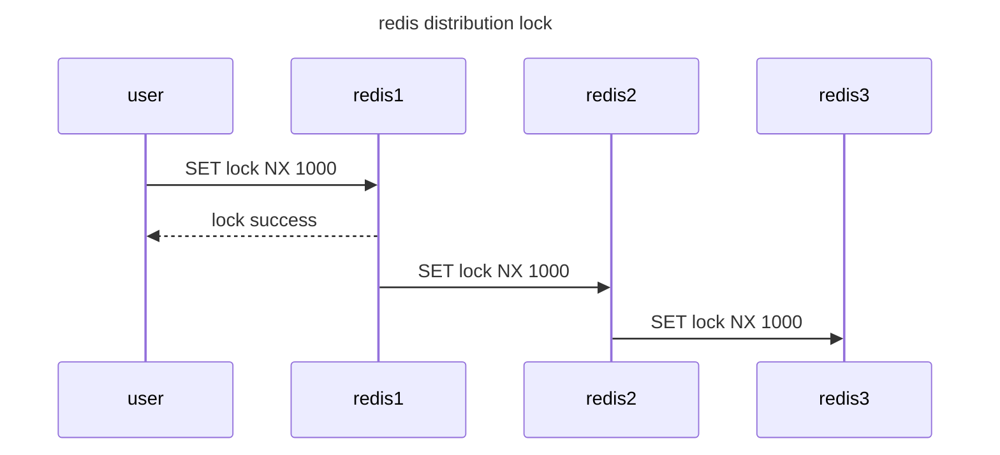
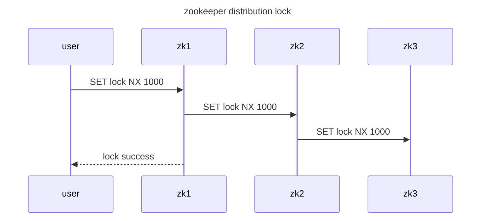

## 1. redis 与 zookeeper

zookeeper更适合使用分布式锁的场景，因为是强一致性的分布式协议,redis集群是最终一致性

### 1.1. redis

```mermaid
---
title: redis distribution lock
---

sequenceDiagram
    user->>redis1: SET lock NX 1000
    redis1-->>user: lock success
    redis1->>redis2: SET lock NX 1000
    redis2->>redis3: SET lock NX 1000
```

### 1.2. zookeeper

```mermaid
---
title : zookeeper distribution lock
---

sequenceDiagram
    
    user->>zk1: SET lock NX 1000 
    zk1->>zk2: SET lock NX 1000
    zk2->>zk3: SET lock NX 1000
    zk1-->>user: lock success

```

- zk 会在集群中所有节点都上锁后才返回用户上锁的结果