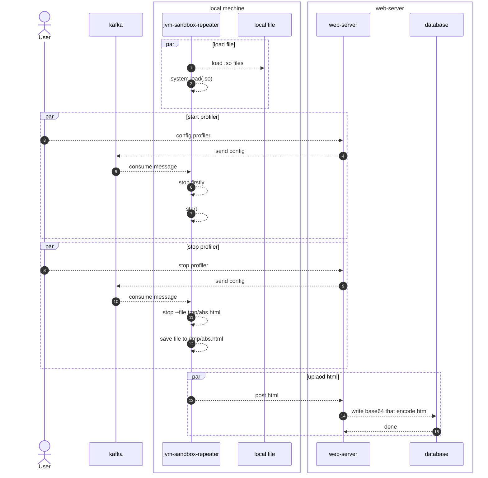

# 需求

在压力测试过程中，需要观测机器的各项性能指标。一般机器上都有Prometheus来记录
jvm中的各项指标。

其中有一个需求，可定位到具体的耗时方法。对此调研后，可以采用aysn-profiler来达到这个目的。

- https://github.com/async-profiler/async-profiler

# 时序图



# profiler命令
```shell

profiler start

profiler execute 'stop,start'

profiler execute 'stop,file=/tmp/result.html'

profiler start --include 'java/*' --include 'demo/*' --exclude '*Unsafe.park*'


```