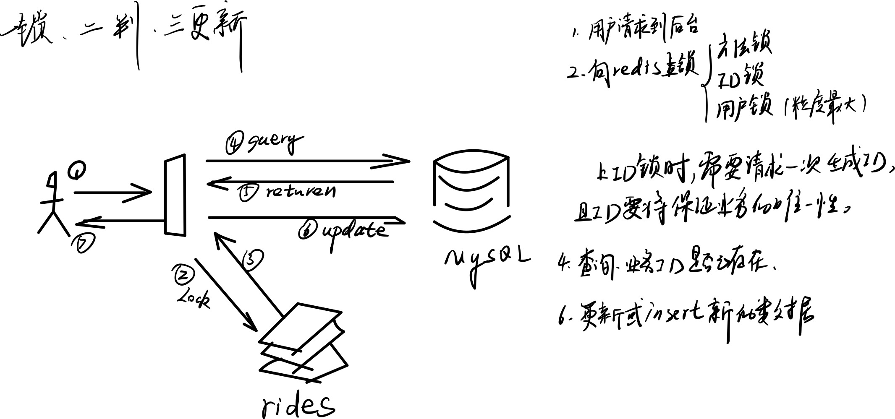

# 什么是幂等方法

同样的参数，经过多次调用，返回的结果都一样的，这样的方法，是幂等方法

# 哪些场景需要幂等

- 前端重复提交表单，包括下单、投票
- MQ消息重试

上述场景不管是网络抖动、报文发送方自带的重试机制，都应该是保证接口的幂等

# 实现幂等的方式

## 数据库唯一键
为数据库的表，建立组合的幂等键，在insert时，就会抛出重复key的异常。
适合于**新增**和**删除**的动作

## 乐观锁
使用版本号或时间戳实现乐观锁，更新前先查询出旧的版本号，更新时增加版本号相同的条件，进行**更新**时的幂等。

## token防重
同一个业务请求，分为两个阶段，
- 阶段一：请求到一个token
- 阶段二：发送业务请求（将token回传）

请求到了服务器，判断token是否存在，存在说明是第一次发送请求，可以通过，执行业务流程，删除token；
token不存在时，说明先前已经处理过了，返回第一次处理过的结果。

适于于**新增、更新、删除**的操作

## 唯一序列号
上游给下游发送请求时，携带一个唯一业务主键，如在MQ消息体中携带，
唯一键，在MQ消费异常时，自动重试时，保证同一份数据，不会被多次消费。

# 幂等方法的实现：一锁二判三更新

# 参考
- https://blog.51cto.com/panyujie/6103122#_6