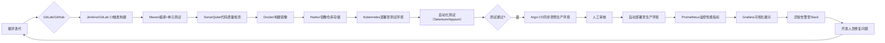

# 1. 摘要
本文以中部某省社区电商平台的技术演进过程为背景，立足于《流量录制平台的研发与实现》项目在Devops平台在最佳实践。首先简述Devops的具体引入过程，落实到公司内容每条细分业务线的生产过程。然后详述在本人负责的流量录制平台研发项目过程中，基于Devops平台从产品需求、概要设计、详细设计、编码实现、测试验证、生产部署、产品验收发布的全链路流程；经过初版使用，收到用户反馈，建立新的迭代，再进行更新升级的持续集成、持续部署过程。最后总结Devops平台在软件系统开发中的作用和重要性。
# 2. 背景介绍
公司背景：中部省份某社区电商互联网公司，自2021年起，社会电商业务从本省逐渐覆盖华东、华中、华南等地区，日均活跃用户在200万以上，并持续增长，提货门店在从原省内的50万家，逐步推广到全国100多万家，并不断的新门店入驻。公司内部业务线主要包括常见的电商中台线：交易线、支付线、业财线、资金线、门店线、营销线、用户线等；物流产品线：库存线、供应链线、物流运输线等；以及其他平台（前端交互平台、中间件系统、云原生系统、大数据平台、测试平台、内部ERP、CRM、HR等系统）总计达到1000套系统。
人员背景：作者作为技术质量中台的高级测试开发工程师，主要负责性能平台、流量录制平台、数据回放平台的开发维护工作，以及电商中台部分业务级的质量工作。
项目背景：从公司背景中的用户规模、系统总数可以看出，在用户数量持续增长、需求快速变化背景下，结合中主要是采用基于微服务的分布式架构的设计，正面临着系统维护数量多、种类杂、项目迭代快、并行项目多等项目管理问题。这为质量保障人员（测试工程师）带来了许多挑战，其中一个最费时的问题就是：如何快速定位问题的发生，例如UI测试工程师在测试用户优惠下单时，报错了，他不知道问题发生在哪些业务线，可能是用户被风控、库存超卖、营销锁券失败等等，我们提示到前台，只有系统繁忙，具体的后台错误，需要测试人员自己去每个业务系统的后台日志时搜索具体的原因，他的工作链路会非常长，所以我们需要一个分布式的流量录制平台，可以跨机器的生成一链完成的业务链路，帮助我们快速定位问题所在，分析原因，提出缺陷。为此我们研发了流量录制平台。
# 3. Devops引入
随着经济的快速发展，人民生活水平不断提升，移动互联网的快速普及，中国互联网网民达到11.08亿（截止2024年12月）。随之而来的就是指数级膨胀的数据总量、多变的用户需求、持续新推的软件产品。如果还是采用传统的系统过程（原型模型），加上人工的软件过程管理，低效的人员沟通（产品经理、开发人员、测试人员、UI设计师）很难满足现在市场环境的互联网公司发展，随着时间的推移，许多问题暴露出来：
1. 系统运维问题：在需要繁多、产品快速演进、用户增长、数据总量激增的背景下，每次新版本发布，如何还是传统的人工作业：先远程登陆新机器，执行脚本启动新服务，再远程登陆网关或是流量入口的机器，将流量转发到新机器，最后下线旧机器。这样的过程太过低效，且人工操作需要保障执行的可靠性，所以我们需一个可以持续部署（Continuous Deployment）的平台，可以和Docker和K8s等技术融合，自动化的部署、运维我们的系统，在简化我们的运维工作的同时，可以统一高效地管理运维过程，保证系统的可靠性；
2. 需求迭代跟踪问题：现在产品原型是不断的演进，电商业务也随着人民生活水平的提高不断的变化，意味产品经理会源源不断的提出新的产品需求和原型，每个UI设计师、开发工程师都是在并行交替的设计研发多个版本的产品，所以如何将每个需求与产品设计文档、技术文档、UI设计等关联起来，统一管理他们的生命周期，自动合并个版本需求的分支，因此我们一个全方位多样性的持续集成（Continuous Integration）的平台；
3. 沟通问题：在一个软件系统从0到1的建设过程中，有许多的角色会参与其中，包括产品经理、UI设计师、前端工程师、后端工程师、质量工程师、数据工程师等，必要时技术运维工程师也会参与一些沟通会议。大多时候只是在不断的项目周期只有部分成员参加，如何需求评审，技术方案评审、测试用例评审、上述人员可以全体参加，可能因为排期冲突因素，有些成员不能参加，或是评审过程中，意见不统一，怎么修改、在具体哪一个环节修改，修改后怎么落实。这些工作在先前都是人工的维护自己的文档（产品经理维护产品文档、开发人员维护技术文档），各类会议的生命周期仿佛只存在会议期间，会议之后，各类会议、文档、角色他们在各自维护的同时，应该是协同一体的，我们需要一个工具或是平台，帮我统一管理各类角色、文档、会议在一个需求迭代的生命周期，打破信息的孤岛，提效我们沟通。
综上所述，我们急需一种全方位、全角色、全过程的工具，来管理协调整个项目过程，可以覆盖所有项目人员，快速高效而又全面的系统来克服现存的问题。为此我们引入了Devops平台，Devops主要包括了代码管理、持续集成、持续部署、监控与反馈、容器管理、协作和流量管理（需求管理、质量管理）以及质量管控等几个重要组成部分，一般是gitlab作为代码仓库，jira作为质量平台、jetklin作为devops平台入口，docker作为容器虚拟化工具，k8s作为容器编排平台，prometheus加上ELK技术作为监控平台，同时会集成一些代码静态扫描工具，将所有工作集成在同一流水线时，指定环境，全合代码分支，可以一键部署。极大简化了集成部署工作。
# 4. Devops实际应用
采用原生的Devops，直接应用社区电商这一业务领域，不是满足现有问题，为此我们参考了阿里巴巴内部的Devops平台Aone，借鉴了其设计，并结合公司内部一些实际情况，研发了Xone平台，其保留Devops功能的同时，还增加了角色管理（产品经理、UI设计人员、开发工程师、测试工程师等）、文档集成、质量管理、环境隔离等（生产环境、测试环境、灰度环境、日常环境等）、过程管理功能。本章节将结合流量录制平台的研发过程及具体迭代，讨论Devops在生产过程的实际应用以及对当前软件过程的影响。
作为流量录制平台的主要负责人，自己除了是开发人员，同时兼任了产品经理和深度使用用户的角色。调研了目前主流的开源框架，结合公司内部的技术栈，最终我们决定基于阿里巴巴开源的Jvm-sandbox-repeater进行二次开发。以下工作全部要Xone平台上进行管理：
## 4.1. 项目新建
项目新建：首先系统负责人在Xone上新建了一个项目，填写了关键信息（名称、唯一标识、简介）后，会提示是否会关联或是新建，一个或多个代码仓库，关联一个之前在本地gitlib代码仓库中新建的仓库后，一个项目新建完成。
需求新建：产品经理新建一个初版构建的需求，添加需求名称，会自动生成一个需求文档，里面要求产品经理（项目经理）上传自己的需求文档或是产品原型，并指定需求的开始日期和结束日期。
人员关联：一个需求会关联到具体的产品经理、UI设计人员、前端开发工程师、后台开发工程师、测试工程师、数据工程师等。
需求评审：要求对产品经理的需求文档、产品方案进行评审，一般情况下，需求关联到人员要到位与会。
## 4.2. 系统开发
分支建立：前端、后台开发工程师会根据需求关联的人员、项目新建一个或多个代码分支；
技术方案：在这个需求迭代过程中，流转到了开发人员，要求开发人员上传自己的技术方案、接口文档，并进行技术方案评审，将评审意见追加到技术方案后；
开发周期：开发工程师，需要明确具体的排期（包括提测日期）；
自测：开发完成后，开发人员会在日常环境进行单元测试和集成测试，完成后，会进行提测；
## 4.3. 测试
测试用例评审：一般情况下，在技术方案评审后、提测前，测试工程师要根据产品文档、技术文档将测试用例编写完成，并完成评审工作，对未覆盖到的测试场景查漏补缺，并补全测试用例，一般会在此时，给出冒烟日期、测试排期；
测试环境冒烟：接收到开发人员的提测后，在流水线中，冒烟准入，合并分支部署在测试环境，进行冒烟测试，不通过则打回，重新提测；
测试过程：测试完成后，提交到灰度环境，让产品经理进行灰度验收；
## 4.4. 用户灰度
开发人员会测试过程中，编写上线方案，检测点、回滚方案等，让产品经理圈选灰度的机器，如业务风险降低的客服系统，在此系统的3台机器中，先部署2台流量录制平台，灰度观察1周，查看业务系统的性能受到流量录制平台的影响程度（CPU占用率、内存使用率、垃圾回收的耗时、次数等有没有明显的增多），观察正常后，逐步放开灰度。
## 4.5. 上线
灰度环境验证完成后，可以全量放开，真正上线，上线后，开发人员和系统负责人也要进行系统观测，至少在2小时内，线上日志不能有错误告警。
## 4.6. 总结与展望
目前，软件系统的飞速发展、硬件设备性能快速增长 ，让软件系统的升级更新愈加频繁，之前的人工处理阶段，越来越难以满足现实发展，继续采用人工处理，不仅会增加各类人员的工作量，提高工作难度，在一定层面还会增加业务风险、降低工作效率，因为一般情况下，大的项目迭代，线上发布都会在活跃用户较少、业务请求回落的凌晨，人员工作效率相对白天更低下，带来的风险更高。引入了devops极大的提升了工作效率，可以通过CI/CD，满足现实快速迭代、全过程管理、项目闭环的需要。

# 5. Devops平台设计

DevOps平台是一套覆盖软件开发全生命周期的工具链与方法论体系，通过自动化和集成化手段，实现从需求到部署的高效协作。其核心组成部分可分为以下六大模块，各模块通过标准化接口协同工作，形成闭环：

### 5.1. **一、代码管理（Version Control）**
**功能**：存储代码、追踪变更、支持团队协作  
**关键工具**：  
- **Git**：分布式版本控制系统，支持分支管理、代码合并与回滚  
- **GitLab/GitHub/Bitbucket**：代码托管平台，集成CI/CD触发、代码审查（PR）与Wiki文档  
- **Gerrit**：基于Git的代码审查工具，适用于大型团队的严格代码准入控制  
**实践要点**：  
- 采用GitFlow或GitHub Flow分支模型，主分支保持可发布状态  
- 通过Hooks机制自动触发代码扫描（如提交前执行单元测试）

### 5.2. **二、持续集成（CI）**
**功能**：自动化构建、测试与质量检查，确保代码集成的可靠性  
**关键工具**：  
- **Jenkins/GitLab CI/GitHub Actions**：自动化构建服务器，支持多语言与多平台  
- **Maven/Gradle（Java）**：依赖管理与构建工具  
- **Docker**：容器化打包，确保环境一致性  
- **SonarQube**：代码质量检测，分析代码漏洞、重复率与复杂度  
**实践要点**：  
- 构建流水线包含编译、单元测试、集成测试、静态代码分析等阶段  
- 设置质量门禁（Quality Gate），如测试覆盖率低于80%则阻断部署

### 5.3. **三、持续部署/交付（CD）**
**功能**：自动化将代码部署至测试、预生产及生产环境  
**关键工具**：  
- **Kubernetes（K8s）**：容器编排平台，实现自动化部署、扩缩容与负载均衡  
- **Helm**：K8s应用包管理工具，简化复杂应用的部署配置  
- **Argo CD/Flux**：GitOps工具，通过Git仓库状态自动同步K8s集群配置  
- **Ansible/Terraform**：基础设施即代码（IaC）工具，自动化环境配置  
**部署策略**：  
- 蓝绿部署：同时维护新旧版本，通过负载均衡切换流量  
- 金丝雀发布：向小部分用户灰度发布，验证通过后全量推送  
- 滚动更新：逐步替换旧版本实例，实现零停机部署

### 5.4. **四、监控与反馈（Monitoring & Feedback）**
**功能**：实时监控系统运行状态，收集用户反馈以驱动迭代  
**关键工具**：  
- **Prometheus+Grafana**：开源监控系统与可视化平台，采集指标数据  
- **ELK Stack（Elasticsearch+Logstash+Kibana）**：日志收集、存储与分析  
- **Jaeger/Zipkin**：分布式链路追踪，定位微服务调用瓶颈  
- **Sentry**：异常监控与错误追踪，自动告警并关联代码上下文  
**实践要点**：  
- 设置关键指标监控（如响应时间、错误率、吞吐量）  
- 建立告警分级机制（P1~P4），确保紧急问题快速响应

### 5.5. **五、容器与基础设施（Container & Infrastructure）**
**功能**：提供标准化运行环境，实现资源弹性伸缩  
**关键组件**：  
- **Docker**：容器化技术，将应用及其依赖打包为独立单元  
- **Kubernetes**：容器编排，管理大规模容器集群  
- **Harbor/Nexus**：容器镜像仓库，存储与分发Docker镜像  
- **AWS/Azure/GCP**：云服务提供商，提供计算、存储、网络资源  
- **Vault**：密钥管理工具，安全存储与分发敏感信息（如数据库密码）  
**实践要点**：  
- 通过Horizontal Pod Autoscaler（HPA）实现基于负载的自动扩缩容  
- 使用Network Policy限制容器间网络访问，增强安全性

### 5.6. **六、协作与流程管理（Collaboration & Workflow）**
**功能**：连接团队成员，管理需求、任务与知识库  
**关键工具**：  
- **Jira/Trello**：敏捷项目管理，追踪需求、缺陷与任务进度  
- **Confluence**：团队协作平台，沉淀文档与最佳实践  
- **Slack/Microsoft Teams**：即时通讯工具，支持跨团队沟通  
- **ChatOps工具（如Jenkins+Slack集成）**：通过聊天命令触发CI/CD操作  
**实践要点**：  
- 需求与代码变更建立双向追溯关系（如Jira Issue关联Git Commit）  
- 通过自动化通知（如部署成功/失败消息）减少信息差

### 5.7. **▶ 典型DevOps工具链集成示例**

### 5.8. **七、延伸组件（可选）**
根据企业需求，还可扩展以下功能：  
- **安全工具**：  
  - **OWASP ZAP**：Web应用安全扫描  
  - **Trivy**：容器镜像漏洞检测  
  - **Open Policy Agent（OPA）**：统一策略管理  
- **测试工具**：  
  - **JMeter/K6**：性能压测  
  - **Postman**：API自动化测试  
  - **Cucumber**：行为驱动开发（BDD）框架  
- **成本管理**：  
  - **AWS Cost Explorer**：云资源成本分析  
  - **Kubecost**：Kubernetes集群资源使用与成本监控  

### 5.9. **总结：DevOps平台的核心价值**
通过整合上述工具与流程，DevOps平台实现了：  
1. **自动化**：减少手动操作，降低人为错误  
2. **可视化**：全流程透明化，问题定位更高效  
3. **反馈闭环**：快速响应生产问题，驱动持续改进  
4. **协作效率**：打破部门墙，提升跨团队沟通质量  

企业可根据自身规模、技术栈和业务需求，选择合适的工具组合构建DevOps平台，逐步实现从传统开发模式向敏捷、高效的现代化软件工程体系转型。