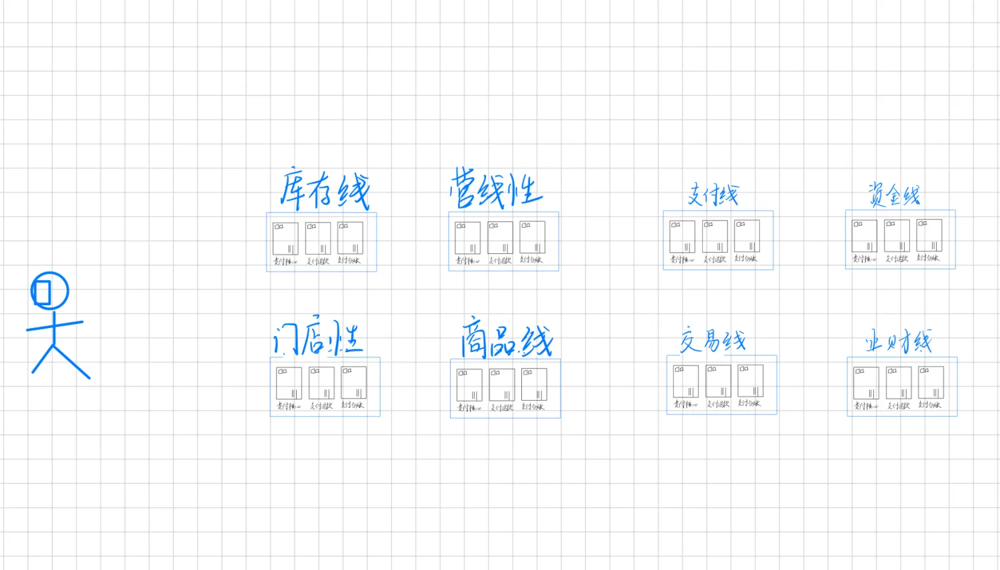

# 1. 摘要

随着数据量的爆发式增长与用户需求的多元化演进，各类业务系统已从孤立的信息单元转变为深度互联的有机整体。在频繁的数据交互过程中，系统需随时应对突发高流量冲击，这使得性能测试的重要性愈发凸显。本文立足电商系统的性能测试实践，结合国内外主流技术架构，通过两个典型业务场景的性能测试实例，系统阐述性能测试实施过程，深入分析测试结果，精准定位性能瓶颈，并提炼出契合当前软件市场实际需求的性能测试方法论。全文共分四章：第一章概述单位技术背景及个人实践经历；第二章剖析项目业务需求与系统架构设计；第三章详述电商平台中两类关键业务场景的性能测试实施过程，包括测试环境搭建、脚本设计、压力模型构建及瓶颈分析等核心环节；第四章对性能测试工作进行系统性总结，归纳实践经验，并对未来性能测试技术在电商领域的发展方向进行前瞻性展望。

# 2. 背景介绍：

## 2.1. 单位背景：

本文工作是在中部省份头部电商平台进行，用户规模在500万以上，供应商和门店在100万以上，日均订单量在100万以上，在春节、618、双11等促销活动，可以达到千万订单量，订单额度可以达到亿级。

## 2.2. 个人背景：

作为资深测试开发工程师，笔者深度参与企业级性能测试平台的搭建与迭代，主导多轮大促场景下的性能验证工作，并与开发、运维团队协同构建系统可靠性保障体系。

# 3. 项目

## 3.1. 需求分析、市场调研与技术选型

在大数据时代背景下，性能测试平台已成为各领域互联网企业的核心基础设施。面对复杂业务系统的性能优化需求，如何从无到有构建契合企业业务特性的性能测试平台，精准实现系统性能指标验证、定位性能瓶颈，成为技术团队面临的重要挑战。如图所示（因篇幅限制，架构图已简化），公司核心业务系统采用领域驱动的微服务架构，遵循业务边界进行垂直拆分：首先按业务领域划分为独立的业务线，每条业务线进一步依据功能内聚原则拆解为细分领域服务，形成层次化的微服务架构体系。
随着移动互联网流量爆发式增长，金融、保险、医疗、教育等主流行业的业务系统正经历从单体架构向领域模型驱动的微服务架构转型。以电商系统为例，其典型拆分模式涵盖物流、供应链、用户中心、交易引擎、支付网关、资金结算等核心领域 ——
各业务线内部通过领域建模实现逻辑内聚，外部通过标准化接口实现跨领域通信，形成 "高内聚、低耦合" 的分布式系统生态。该架构模式深度融合
DevOps
工具链与云原生部署平台，能够高效响应业务需求迭代与流量波动：通过服务网格实现流量治理，借助容器化部署提升资源利用率，依托持续集成 /
持续部署（CI/CD）管道缩短发布周期，最终达成系统可靠性、可扩展性与健壮性的全面提升。

基于领域驱动的微服务架构设计，结合高性能、高可用的技术实现目标，系统技术栈遵循 "分层解耦、组件化复用" 原则，核心技术选型如下：

1. 开发语言及框架体系
   ● 后端技术栈采用 Java 作为核心开发语言，基于 Spring Boot 构建轻量化微服务基座，通过 Dubbo 实现高性能服务治理：
   ● Spring Boot：快速构建独立微服务，内置嵌入式容器简化部署，集成 Actuator 实现服务监控
   ● Dubbo：提供服务注册发现、负载均衡、流量控制等核心能力，支持多协议（Dubbo/RPC/HTTP）适配
   ● 配套技术：MyBatis Plus 数据持久化、Swagger 接口管理、Hystrix 熔断降级
   ● 前端技术栈基于 Node.js 构建前后端分离架构，采用 Vue.js 实现响应式用户界面：
   ● Vue.js：组件化开发模式提升视图层复用性，配合 Vue Router 实现单页应用路由管理
   ● Element-UI：提供统一的企业级 UI 组件库，适配多端设备显示
   ● Node.js：作为中间层实现接口聚合，降低前后端联调复杂度
2. 云原生运维体系
   ● 容器化部署：Docker 实现应用轻量化封装，通过镜像仓库（Harbor/Registry）统一管理服务镜像
   ● 集群管理：Kubernetes（K8s）作为容器编排引擎，实现服务自动扩缩容、故障自愈与灰度发布
   ● DevOps 工具链：Jenkins 构建 CI/CD 管道，结合 GitLab 实现代码版本控制，SonarQube 进行代码质量检测
3. 分布式中间件支撑
   ● 消息通信：
   ● RocketMQ/Kafka：支撑高吞吐量的异步消息通信，满足订单处理、库存同步等业务场景的最终一致性
   ● RabbitMQ：实现低延迟的实时消息交互，适用于用户通知、日志采集等轻量级场景
   ● 服务治理：Nacos 作为注册中心与配置中心，提供动态服务发现与分布式配置管理
   ● 缓存加速：Redis 集群实现热点数据缓存，降低数据库访问压力，提升接口响应速度
4. 数据存储体系
   ● 关系型数据：MySQL 集群承载核心业务数据，通过读写分离与分库分表应对高并发交易场景
   ● 分布式数据库：ADB（AnalyticDB）支持海量数据的离线分析与实时查询，满足业务报表、用户行为分析需求
   ● 搜索引擎：Elasticsearch 构建全文检索服务，实现商品搜索、日志分析等复杂查询场景的高性能响应
   ● 缓存与队列：结合 Redis+Kafka 实现数据的多级缓存与异步处理，平衡数据一致性与系统吞吐量
   上述技术选型深度契合微服务架构的设计目标：通过 Spring Boot+Dubbo 实现服务轻量化开发，利用 K8s+Docker
   构建弹性部署环境，借助分布式中间件解决服务通信与数据流转问题，最终形成 "开发 - 测试 - 部署 - 运维"
   全链路的技术支撑体系，为性能测试平台的建设提供了坚实的架构基础

## 3.2. 系统架构设计
经过技术市场调研，结合公司实际需要，以JMeter开源框架作为主要的性能测试基础平台，向上再开发一套性能测试管理平台，用于管理和协调性能测试的资源。概要架构图如下所示:

这样开发人员、测试人员、运维人员、产品经理可以不用再关注jmeter的使用细节，具体的实施步骤已经由性能平台统一完成，性能测试工作的配置也将性能测试管理平台完成，并为使用者提供了更友好的交互界面、数据统计指标界面等。同时，作为该平台的开发和维护人员，可以二次开发一些符合公司技术栈的通信协议（如RPC），以满足本地化订制的需要，进一步为性能测试提效。

# 4. 性能测试场景

## 4.1. 商品库存查询
业务背景：电商领域的下单场景下，商品库存服务作为相对靠后的业务系统，为用户线、营销线、交易线、供应商线、物流线等多条业务线提交数据的读写接口。为了保证在特殊活动时期，如双11、618等大促活动，为消费者提供稳定可靠的电商系统，需要对商品库存系统进行压力测试，以确保在突发流量出现，系统可以稳定运行。
性能要求：库存业务线系统需要提供一个新的接口，给上下游的业务线查询当前具体商品的库存，要求达到单机QPS2000，单次请求的RT时间在300ms以内，超过会存在潜在风险：用户在平台下单时，因为库存查询超时，或失败，错过想购买的商品。
性能测试方案：使用Jmeter作为主要压力测试软件，部署2台打压机，配置都是8核16G的，为达到预期结果，在Jmeter中配置了2个线程组，每个线程组有200线程同时请求这个新接口。从生产环境同步一些数据到压力测试环境，经过2小时压力测试，观测打压机和业务机器的CPU使用率、内存使用率以及垃圾回收情况，平均QPS低于300ms，成功在100%，符合预期。为了进一步验证系统在突发情况的稳定性，升级打压机为4台机器，将单机的QPS突破限定值2000，测试时长加长到8小时，观测到问题：到了7小时左右，出现了QPS超过300ms，查询失败的情况。通过分布jvm的GC日志发现，在7小时的阶段，业务机器出了FGC，引了STW（Stop
the world）情况，在此情况中，存在数据的慢查询，导致查询失败。
问题定位：在正常流量情况下，有限时间内可以达到预期，但是经过长时间的系统运行，遇到峰值流量时，会出现异常情况，原因定位是垃圾回收机制设置不正确导致的，后续采用G1的垃圾回收机制，降低的FGC的次数和时长，有效避免了高流量情况下，FGC引发的数据慢查询情况。

## 4.2. 商品标签查询
业务背景：在商业活动最常见的就是促销活动，在电商线上平台，为保障促销活动的顺利开展，需要提前作好预估，活动的时长、活动的流量规模，以提前做好准备，进行线上机器的横向扩容。公司的商品线需要提供一个新的商品标签查询接口给交易线，以保障带了特定标签的商品，可以在促销活动进行下单活动。
性能要求：要求达到单机QPS6000，为了流程更多的时间给下游的业务线完成后续的下单流程，本接口单次请求的RT时间在20ms以内，为此在技术方案选型时，只能采用本地缓存的方式存储商品标签数据，又因为商品标签是提前一天设置好，活动开始前就从缓存中间件（redis）同步到本地内存中，所以此次性能压测压力暂不考虑数据一致性的问题以及缓存被击穿、雪崩的场景。
性能测试方案：使用Jmeter作为主要压力测试软件，部署2台打压机，配置都是8核16G的，为达到预期结果，在Jmeter中配置了1个线程组，每个线程组有150线程同时请求这个新接口，1000ms/20ms=50，150*
50=7500QPS，可以达到预期的设定。从生产环境同步一些数据到压力测试环境，经过1小时压力测试，观测打压机和业务机器的CPU使用率、内存使用率以及垃圾回收情况，平均QPS可以达到20ms，成功在100%，符合预期。为了进一步验证系统的鲁棒性，将每次返回的商品标签从1个，提升到50个，即极端情况下，一个商品可能同参加50个不同的促销活动，又经过1小时的持续测试，发现在QPS的成功率在固定间隔时间后，会缓慢下降，后慢慢攀升，又缓慢下降，呈现正弦函数式的波动变动。登陆到业务主机，观测时日志中出现ERROR信息，RPC服务的线程拒绝了服务。
问题定位：在正常流量情况下，可以达到预期，将业务场景复杂化，出现了请求失败的情况，结合性能需求、测试场景、测试结果波动、后台日志等多类佐证因素，界定出原因是：单次请求返回数据量增大时，RT时长也会增长，为了保证20ms的RT时间，业务机器会主动限流，将业务执行线程主动拒绝后续新增的请求。
参考方案：在异常情况下，服务主动限流是符合现实需要的，当实例机器只能提供有限的服务时，主动拒绝不能满足的请求，可以保障业务局部可用和系统的可靠性。如果要求必须满足所有请求，可以通过以下2点达到要求：1、单机的扩容，提高实例机器的CPU和内存配置，能让一台单机处理更多的请求；2、服务器集群的扩容，横向的增多实例机器数量，提升吞吐率，满足业务的性能需求。

# 5. 性能测试分析与总结

针对当前主流的系统架构，性能测试也愈加重要且富有挑战性，要求测试人员不仅要十分熟悉业务场景，也要对现在架构有着深刻的理解。主要测试步骤如下：
1、明确出性能的要求：主要包括QPS、TPS、RT、成功率、容错率等性能指标；
2、界定出此次性能测试的上下流调用关系，以及影响的业务范围，评估好测试的工作量，可以通过沟通（与开发人员、运维人员、产品经理）整理好测试数据和测试场景（正常数据、异常数据、突发流量、低谷流量）；
3、制定出完整的测试方案：根据1、2点明确打压机的配置（CPU、内存、线程池配置），具体的性能测试时长、次数、异常测试用例占比、峰值流量时长占比等；
4、实施测试方案：按照制定的测试方案执行，观测业务系统的各项性能指标：CPU使用率、内存占用率，垃圾回收情况、系统告警日志等等。同时，也要观测打压机的些性能指标：成功率，RT时长等等。
5、撰写测试报告：根据最终的测试结果，结合准出标准，描写撰写测试报告，对于性能测试不达标的结果，给出建设性的技术方案。

## 5.1. 问题定位方法小结：
常见的性能瓶颈主要有：业务系统层、数据层、缓存层、中间件；
数据层：不管是关系型数据库（Mysql、Orace）还是非关系型数据库（Elastic
Search），随时数据总量的增长，分库分表有效应对的方式，但是要合理的设计分库分表字段，以及导致慢查询影响关键业务，所以在针对此类技术方案的性能测试，要重点关注分库分表字段的异常情况（如空、非法字段、缺失）是否造成慢查询以及更严重的脱库事件的发生。同时也要关系索引的命中率。
缓存：缓存技术主要应用在一些高性能的系统中，如商品标签、营销活动，对高缓常见的击穿、雪崩、穿透等问题的测试用例要考虑到性能测试过程中，作为全面的异常测试工作。
在使用到了MQ技术的业务系统中，MQ的吞吐量、是否要求顺序消费，消费错位后，如何重试补救（消息重发、消息重试）是必不可少的。
在业务系统层，要注意与实现的业务场景结合以应对性能问题，如某经济发达省份的流量为远超于欠发达地区。线程池是否满了，具体的拒绝策略是什么，超时时长应该设置多少最合适。垃圾回收机制的设定是否合理，并非最新的垃圾回收器就是最合适的，选择合适的垃圾回收器，才是有效的性能调优方式。

从经验的角度，在高并发，高流量的分布式电商系统，一般来讲，用户线、商品线、营销线的查询业务单机QPS要求至少高于1000，RT时间一般在100到300ms之间，交易线、支付线、营销线的业务单机TPS在100到1000等，但是RT时间不超过500ms。以下单业务场景为例，当某个环节，如商品库存锁定时，时间超过300ms，会导致整个下单时长超过1秒，给用户带不好的体验。如果遇到了大促场景，库存线多台部署实例同时超过300ms，可能会导致整条链路的降级或是主要熔断。因此在性能测试时，全链路的压力测试是非常重要的一环。