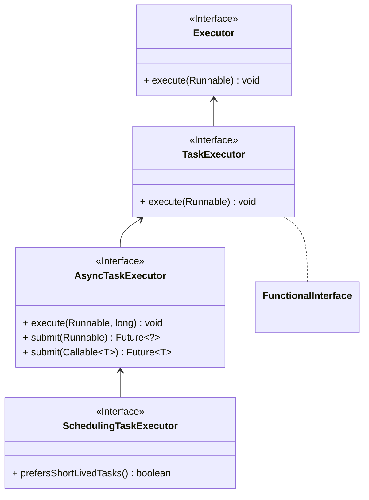

# 1. 包结构

- 位于spring-context的包下面

# 2.  Class

## 2.1. SchedulingTaskExecutor

```mermaid
classDiagram
    direction BT
    class AsyncTaskExecutor {
        <<Interface>>
        + execute(Runnable, long) void
        + submit(Runnable) Future~?~
        + submit(Callable~T~) Future~T~
    }
    class Executor {
        <<Interface>>
        + execute(Runnable) void
    }
    class FunctionalInterface
    class SchedulingTaskExecutor {
        <<Interface>>
        + prefersShortLivedTasks() boolean
    }
    class TaskExecutor {
        <<Interface>>
        + execute(Runnable) void
    }

    AsyncTaskExecutor --> TaskExecutor
    SchedulingTaskExecutor --> AsyncTaskExecutor
    TaskExecutor --> Executor
    FunctionalInterface .. TaskExecutor


```

## 2.2. SchedulingAwareRunnable

## 2.3. ScheduledAnnotationBeanPostProcessor