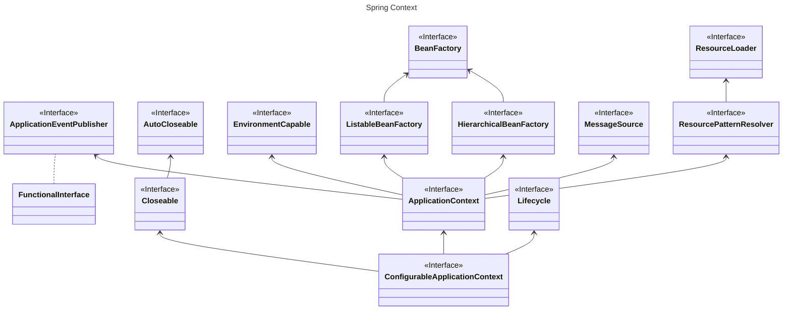
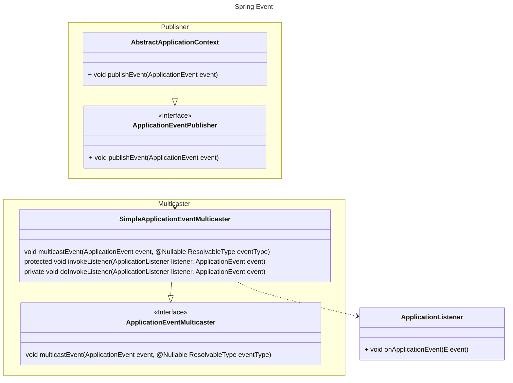
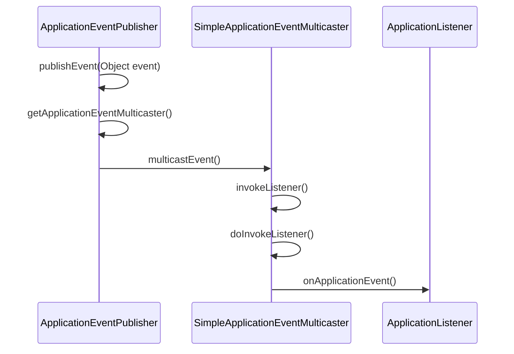

# 1. ConfigurableApplicationContext的结构



BeanFactory本身功能并不充分，通过一系列的后置处理器来完善，ApplicationContext就实现一系统的后置处理器来完成功能增强。
具体增强哪些功能，在每个Bean定义时，去指定具体的接口，来完成具体的功能。

# 2. Spring 上下文初始化过程

# 3. Spring常见的一些后置处理器

## 3.1. @PostConstruct和@PreDestroy注解

这两个注解分别用于在Spring容器初始化Bean之后和销毁Bean之前执行特定的方法。

## 3.2. LifecycleProcessor 接口

这是一个接口，用于处理Bean的生命周期回调。Spring容器会使用这个接口来调用Bean的init()和destroy()方法。

## 3.3. InitializingBean和DisposableBean接口

两个接口分别定义了afterPropertiesSet()和destroy()方法，当Bean被Spring容器初始化后，会自动调用afterPropertiesSet()
方法，而在Bean被销毁前，会自动调用destroy()方法。

## 3.4. CustomScopeProcessor

这个处理器用于处理自定义的作用域。例如，你可能想要在不同的作用域中管理不同的Bean实例。

## 3.5. BeanFactoryPostProcessor

这是一个特殊的后置处理器，它允许你在Spring容器初始化之前修改或创建Bean的定义。

## 3.6. BeanPostProcessor

这是一个更通用的后置处理器，允许你在Spring容器初始化Bean之后、但在应用上下文启动之前对Bean进行操作。

## 3.7. PropertySourcesPostProcessor

这个后置处理器用于处理@PropertySource注解，允许你在Spring Boot应用中加载属性文件。

## 3.8. CommandLineRunner和ApplicationRunner

这两个接口分别定义了run()方法，当Spring应用上下文启动后，会自动调用这些方法。这使得你可以在应用启动后执行特定的逻辑。

# 4. Spring 上下文类型

- ClassPathXmlApplicationContext：从类路径下的XML配置文件中加载上下文定义，将应用上下文的定义文件作为类资源。
- FileSystemXmlApplicationContext：从文件系统下的XML配置文件中加载上下文定义。
- XmlWebApplicationContext：从Web应用下的XML配置文件中加载上下文定义。
- AnnotationConfigApplicationContext：从一个或多个基于Java的配置类中加载Spring应用上下文。
- AnnotationConfigWebApplicationContext：从一个或多个基于Java的配置类中加载Spring Web应用上下文。
  这些上下文类型都继承自Spring的ApplicationContext接口，并提供了各自的特点和用途。选择适合的上下文类型取决于应用程序的需求和配置方式。

# 5. Aware接口

- BeanFactoryAware：允许将BeanFactory注入到实现该接口的类中。
- ApplicationContextAware：允许将ApplicationContext注入到实现该接口的类中。
- WebApplicationContextAware：允许将WebApplicationContext注入到实现该接口的类中。

# 6. Spring事件

## 6.1. 模型

- 事件 org.springframework.context.ApplicationEvent
- 事件的监听者 org.springframework.context.ApplicationListener
- 事件的发布者 org.springframework.context.ApplicationEventPublisher
- 事件的广播者 org.springframework.context.event.SimpleApplicationEventMulticaster

如下图所示：发布一个事件后，会调用multicastEvent方法，在multicastEvent方法可能线程池异步的调用invokeListener方法。
在invokeListener方法中调用doInvokeListener，真正执行具体的ApplicationListener类中onApplicationEvent方法。



调用时序图如下



## 6.2. 异步发布事件

Spring 发布事件是使用这个类来发布事件，可以指定线程池来异步发布事件
org.springframework.context.event.SimpleApplicationEventMulticaster

```sqlite-psql
@Override
	public void multicastEvent(final ApplicationEvent event, @Nullable ResolvableType eventType) {
		ResolvableType type = (eventType != null ? eventType : resolveDefaultEventType(event));
		Executor executor = getTaskExecutor();
		for (ApplicationListener<?> listener : getApplicationListeners(event, type)) {
		//此处默认是空的
			if (executor != null) {
				executor.execute(() -> invokeListener(listener, event));
			}
			else {
				invokeListener(listener, event);
			}
		}
	}
```

```java

@Configuration
public class Config {

    @Bean
    public SimpleApplicationEventMulticaster applicationEventMulticater() {
        SimpleApplicationEventMulticaster multicaster = new SimpleApplicationEventMulticaster();
        multicaster.setTaskExecutor(Executors.newFixedThreadPool(1));  // 自定义线程池
        return multicaster;
    }
}

```

# 7. spring中的资源

## 7.1. 使用线程上下文

使用maven在打包时，resource文件夹的文件，默认是打包在模块的根目录下。
可以使用线程的上下文获取

- InputStream resourceAsStream = Thread.currentThread().getContextClassLoader().getResourceAsStream(path);

## 7.2. 使用Spring的ApplicationContext

但文件是在包路径下面的某个文件夹中，就需要添加相应的文件路程

```java
// 从类路径下
Resource[]list=context.getResource("classpath:");
        Resource[]list=context.getResource("classpath:*");
        new PathMatchingResourcePatternResolver().getResources("classpath*:mapper/classicmodel/*.xml")
        redisScript.setScriptSource(new ResourceScriptSource(new ClassPathResource("test.lua")));
        Resource[]list=context.getResource("classpath:*/META-INF");
// 从文件路径下
        Resource[]listcontext.getResource("file:");
```

# 8. aop失效


- AOP代理对象失效：在类内部方法中调用同一个类中定义的方法，则调用的是当前的对象，而不是代理对象，则代理失效，注解失效。
- 要增强的类或方法没被spring管理：例如，把Aop的实现类注入到了spring容器中，而要切的类方法是在Controller层，即springmvc容器中的东西。在这种情况下，aop在初始化时会在自己的容器中寻找能够匹配的类方法，因为这些类和方法是在springmvc容器中管理的，因此就没有代理成功。

## 8.1. 解决方法
- 可以采取的解决办法包括将需要进行AOP管理的方法放在独立的类中定义；
- 将Aop的配置切点移到springmvc容器的xml中；
- 使用AopContext.currentProxy()获得当前切面的代理对象，通过这个代理对象来调用方法等。但需要加上配置：@EnableAspectJAutoProxy(exposeProxy = true)