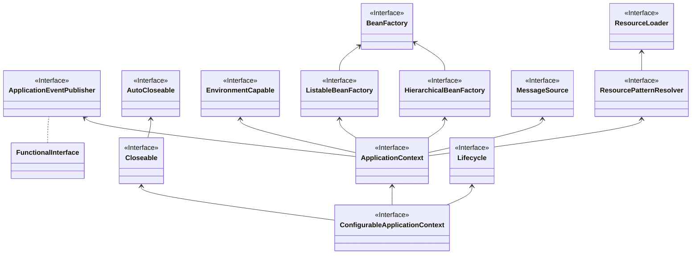
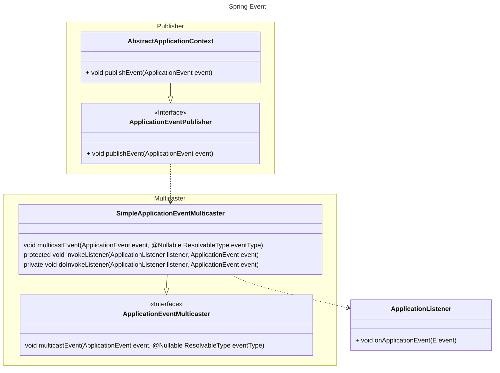

# 1. ConfigurableApplicationContext的结构



BeanFactory本身功能并不充分，通过一系列的后置处理器来完善，ApplicationContext就实现一系统的后置处理器来完成功能增强。
具体增强哪些功能，在每个Bean定义时，去指定具体的接口，来完成具体的功能。

# 2. Spring 上下文初始化过程


# 3. Spring常见的一些后置处理器


# 4. Spring 上下文类型


# 5. Aware接口

# 6. Spring事件

## 6.1. 模型

- 事件 org.springframework.context.ApplicationEvent
- 事件的监听者 org.springframework.context.ApplicationListener
- 事件的发布者 org.springframework.context.ApplicationEventPublisher
- 事件的广播者 org.springframework.context.event.SimpleApplicationEventMulticaster

如下图所示：发布一个事件后，会调用multicastEvent方法，在multicastEvent方法可能线程池异步的调用invokeListener方法。
在invokeListener方法中调用doInvokeListener，真正执行具体的ApplicationListener类中onApplicationEvent方法。



## 6.2. 异步发布事件

Spring 发布事件是使用这个类来发布事件，可以指定线程池来异步发布事件
org.springframework.context.event.SimpleApplicationEventMulticaster
```sqlite-psql
@Override
	public void multicastEvent(final ApplicationEvent event, @Nullable ResolvableType eventType) {
		ResolvableType type = (eventType != null ? eventType : resolveDefaultEventType(event));
		Executor executor = getTaskExecutor();
		for (ApplicationListener<?> listener : getApplicationListeners(event, type)) {
		//此处默认是空的
			if (executor != null) {
				executor.execute(() -> invokeListener(listener, event));
			}
			else {
				invokeListener(listener, event);
			}
		}
	}
```

```java
@Configuration
public class Config {

    @Bean
    public SimpleApplicationEventMulticaster applicationEventMulticater() {
        SimpleApplicationEventMulticaster multicaster = new SimpleApplicationEventMulticaster();
        multicaster.setTaskExecutor(Executors.newFixedThreadPool(1));  // 自定义线程池
        return multicaster;
    }
}

```

# 7. spring中的资源
```sqlite-psql
// 从类路径下
Resource [] list = context.getResource("classpath:");
Resource [] list = context.getResource("classpath:*");
Resource [] list = context.getResource("classpath:*/META-INF");
// 从文件路径下
Resource [] listcontext.getResource("file:");
```