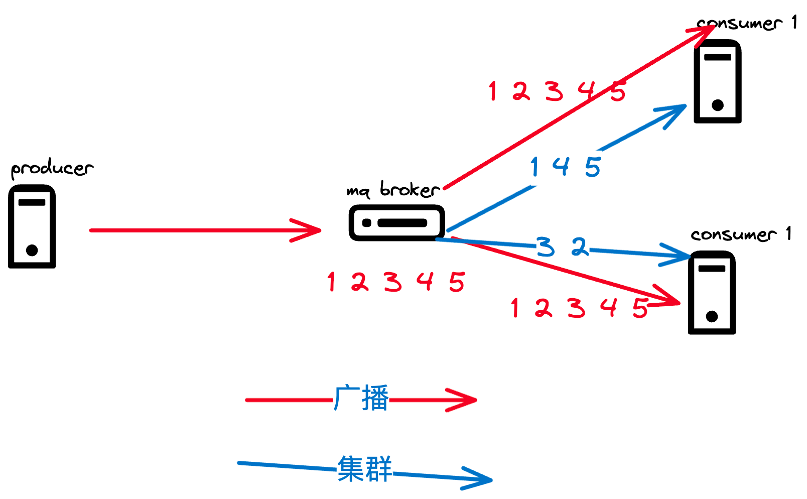
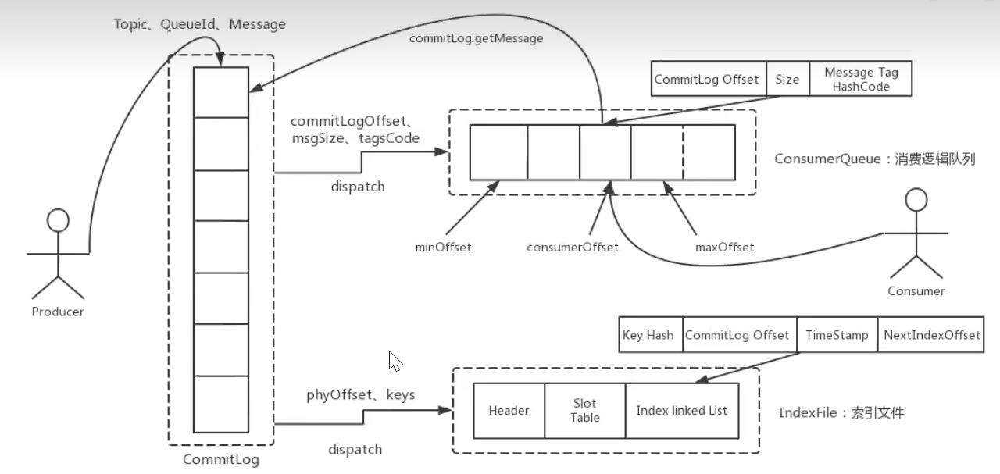

# 1. role


# 2. 消息消费模式

```shell 
org.apache.rocketmq.spring.annotation.MessageModel
public enum MessageModel {
    BROADCASTING("BROADCASTING"),
    CLUSTERING("CLUSTERING");

    private final String modeCN;

    MessageModel(String modeCN) {
        this.modeCN = modeCN;
    }

    public String getModeCN() {
        return this.modeCN;
    }
}

```

- 负载均衡（默认）
- 广播模式



# 3. 消息过滤

- tag
- sql

# 4. 事务消息

- https://rocketmq.apache.org/docs/featureBehavior/04transactionmessage/

# 5. 消息的存储

## 5.1. 存储介质

- 关系型数据库（mysql），如active MQ
- 文件数据 如kafka ，rocket MQ，rabbit MQ，现在**一般的硬盘顺序写可以达到600M每秒**，

## 5.2. 存储模型

- consumerqueue 文件夹：保存某消息在commitlog中的索引

```shell
[app@rocketmq store]$ pwd
/home/app/data/rocketmq/store
[app@rocketmq store]$ ls
abort  abort.bak  checkpoint  commitlog  config  consumequeue  index  lock  timerwheel
[app@rocketmq store]$ cd consumequeue/
[app@rocketmq consumequeue]$ ls
EDU_TOPIC_1  EDU_TOPIC_DELAY_1  RMQ_SYS_TRACE_TOPIC  SCHEDULE_TOPIC_XXXX
[app@rocketmq consumequeue]$ cd EDU_TOPIC_1
[app@rocketmq EDU_TOPIC_1]$ ls
0  1  2  3
[app@rocketmq EDU_TOPIC_1]$ cd 0
[app@rocketmq 0]$ ls
00000000000000000000
[app@rocketmq 0]$ 
```

- commitlog 文件夹：存在消息的元数据
```shell
[app@rocketmq store]$ ls
abort abort.bak checkpoint commitlog config consumequeue index lock timerwheel
[app@rocketmq store]$ cd commitlog/
[app@rocketmq commitlog]$ ls
00000000000000000000 00000000001073741824

```

- index 提供key或时间区域去查询某个消息，不影响发送和消费消息的主流程

## 5.3. 同步刷盘与异步刷盘

前者的可靠性高，后者吞吐性能高

## 5.4. 消息的重试

- 顺序消息的重试存在队头阻塞的问题
- 无序消息（定时、延时、事务消息），只针对集群模式，对广播方式的消费无效，默认可以重试16次，每次的间隔时间会延长。
  对于同一个消息组（GroupId），重试达到上限后，就会进入死信队列，默认3天后会消除

## 5.5. 消息的幂等

- 发送时重复
- 投递时重复
- 负载时重复（网络抖动、broker重启和扩容、Rebalance）