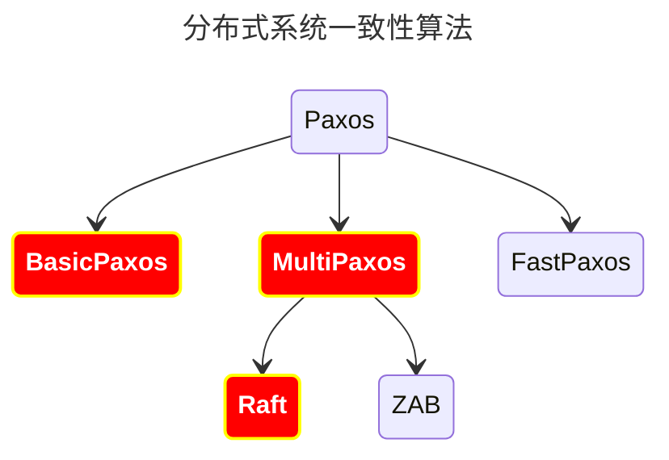

# 1. 分布式系统

## 1.1. 特点

1. 分布性系统在空间维度，不是集中统一，是随意分布
2. 没有主次之分，没有方便管理和被管理的角色，各节点是对等的，但
   是有副本（对数据和服务冗余的一种方式）
3. 并发性：分布式系统会并发的读写一些被共享的存储数据，需要准确高效地协调这些并发操作
4. 缺乏全局时钟：读写存在时序性，谁先谁后，需一个全局的时钟序列控制
5. 故障总会发生

## 1.2. 问题

1. 通信异常：单机内存访问在纳秒级别，但是网络通过可能有是毫秒和秒的级别
2. 网络分区：网络阻塞、网络中断导致部分机器可用，部分不可用，导致网络分区，俗称“脑裂”
3. 三态：成功、失败、超时
4. 节点故障：主机僵死或是宕机

# 2. 分布式事务

## 2.1. CAP与BASE理论

### 2.1.1. CAP

- C:consistency,一致性
- A:availability，可用性
- P:Partition tolerance，分区容错性

```text
 CAP理论不会同时满足，一般只能满足三种中其中两种。当发生网络分区的时候，
 如果我们要继续服务，那么强一致性和可用性只能 2 选 1。也就是说当网络分区之后 P 是前提，决定了 P 之后才有 C 和 A 的选择。
 也就是说分区容错性（Partition tolerance）我们是必须要实现的。
 简而言之就是：CAP 理论中分区容错性 P 是一定要满足的，在此基础上，只能满足可用性 A 或者一致性 C。
```

比如 ZooKeeper、HBase 就是 CP 架构，Cassandra、Eureka 就是 AP 架构，Nacos 不仅支持 CP 架构也支持 AP 架构。

### 2.1.2. BASE

- BA: basic available,基本可用
- S:Soft state，软状态
- E:Eventually consistent，最终一致性

在CAP的一致性与可用性上作权衡，满足在基本可用的情况下，允许部分节点暂时处于软状态，但要确保最终的一致性。

## 2.2. 2pc

- 阶段一：事务协调器（XA）将所有参与到此次业务的数据库预提交
- 阶段二：无异常情况，全部提交；出现不一致或超时，全部回滚

比如MSQL，优点是保证数据的强一致性，适用于对数据强一致性要求高的领域如金融等。

### 2.2.1. 缺点：

- 同步阻塞，参与事务占用的资源，会同步阻塞其他试图获取资源的事务
- XA的单点故障会引起整个系统不可用

## 2.3. TCC

又称为3PC，引入补偿事务：针对每个操作都注册了对应的确认和补偿，来保证数据一致性

- try：先尝试预留所有此次业务需要的资源
- confirm：确认所有资源可用，一般只try成功，confirm一定成功
- cancel：业务执行错误，调用补偿机制，再释放资源

- 由业务发起方负责整个业务活动，XA也引入集群，避免单点故障引起系统不可用
- 引入超时，操作超时后会进行补偿，不用长期占用资源
  本地消息表

### 2.3.1. 事务A修改后，以消息的形式发送给其他参与者

1. 当系统 A 被其他系统调用发生数据库表更操作，首先会更新数据库的业务表，其次会往相同数据库的消息表中插入一条数据，两个操作发生在同一个事务中
2. 系统 A 的脚本定期轮询本地消息往 mq 中写入一条消息，如果消息发送失败会进行重试
3. 系统 B 消费 mq 中的消息，并处理业务逻辑。如果本地事务处理失败，会在继续消费 mq 中的消息进行重试，如果业务上的失败，可以通知系统A
   进行回滚操作

### 2.3.2. 本地消息表实现的条件：

1. 消费者与生成者的接口都要支持幂等
2. 生产者需要额外的创建消息表
3. 需要提供补偿逻辑，如果消费者业务失败，需要生产者支持回滚操作

### 2.3.3. 容错机制：

1. 步骤 1 失败时，事务直接回滚
2. 步骤 2、3 写 mq 与消费 mq 失败会进行重试
3. 步骤 3 业务失败系统 B 向系统 A 发起事务回滚操作
   此方案的核心是将需要分布式处理的任务通过消息日志的方式来异步执行。
   消息日志可以存储到本地文本、数据库或消息队列，再通过业务规则自动或人工发起重试。
   人工重试更多的是应用于支付场景，通过对账系统对事后问题的处理。
   saga事务

## 2.4. 参考

- https://xiaomi-info.github.io/2020/01/02/distributed-transaction/
- https://www.cnblogs.com/savorboard/p/distributed-system-transaction-consistency.html
- https://www.infoq.cn/article/Qg2tX8fyw5Vt-f3HH673  【限流】

# 3. 分布式系统一致性算法

## 3.1. 分类

### 3.1.1. 强一致性

说明：保证系统改变提交以后立即改变集群的状态。系统写入了什么，读出来的就是什么。

模型：
1. Paxos
2. Raft（multi-paxos）
3. ZAB（multi-paxos）

### 3.1.2. 弱一致性

说明：也叫最终一致性，系统不保证改变提交以后立即改变集群的状态，但是随着时间的推移最终状态是一致的。
不一定可以读取到最新写入的值，也不保证多少时间之后读取到的数据是最新的，只是会尽量保证某个时刻达到数据一致的状态。

模型：
1. DNS系统
2. Gossip协议

### 3.1.3. 最终一致性

弱一致性的升级版，系统会保证在一定时间内达到数据一致的状态。



## 3.2. Raft算法

### 3.2.1. 角色定义

- Leader
- Follower
- Candidate

### 3.2.2. 问题

- Leader Election 领导选举
- Log Replication 日志复制
- Safety 安全｜恢复


- https://raft.github.io/

## 3.3. ZAB


## 3.4. Paxos