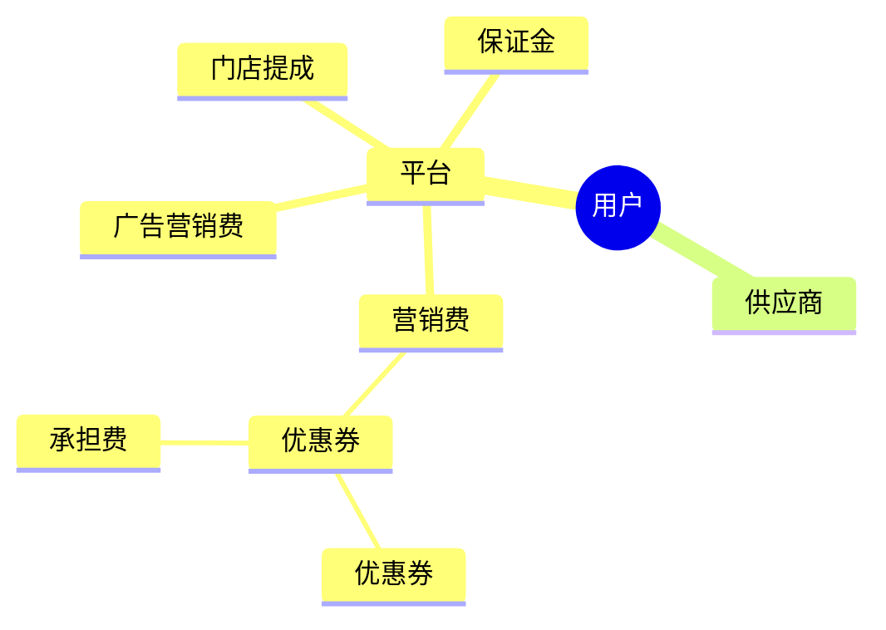

# 1. 微信支付

## 1.1. 正向

微信接口文档 = https://pay.weixin.qq.com/wiki/doc/apiv3_partner/apis/chapter7_7_1.shtml

### 1.1.1. 签约

#### 1.1.1.1. 特约商户进件

- https://pay.weixin.qq.com/wiki/doc/apiv3_partner/apis/chapter11_1_1.shtml
  
比如具体一家电商公司，审核通过以后，会返回一个唯一的sub_mchid

#### 1.1.1.2. 二级商户进件

- https://pay.weixin.qq.com/wiki/doc/apiv3_partner/apis/chapter7_1_1.shtml

  比如某家电商公司的供应商


```text
非小微的主体类型需与营业执照/登记证书上一致，可参考选择主体指引，枚举值如下。
2401：小微商户，指无营业执照的个人商家。
2500：个人卖家，指无营业执照，已持续从事电子商务经营活动满6个月，且期间经营收入累计超过20万元的个人商家。（若选择该主体，请在“补充说明”填写相关描述）。
4：个体工商户，营业执照上的主体类型一般为个体户、个体工商户、个体经营。
2：企业，营业执照上的主体类型一般为有限公司、有限责任公司。
3：事业单位，包括国内各类事业单位，如：医疗、教育、学校等单位。
2502：政府机关，包括各级、各类政府机关，如机关党委、税务、民政、人社、工商、商务、市监等。
1708：社会组织，包括社会团体、民办非企业、基金会、基层群众性自治组织、农村集体经济组织等组织。
```

### 1.1.2. 支付

- https://pay.weixin.qq.com/wiki/doc/apiv3_partner/apis/chapter7_3_3.shtml

- 主单中关键信息：商户号、支付者信息、主订单

- 子单中关键信息：商户号、二级商户号

### 1.1.3. 分账

- https://pay.weixin.qq.com/wiki/doc/apiv3_partner/apis/chapter7_4_1.shtml

- 出资方：二级商户号=分账出资的电商平台二级商户，填写微信支付分配的商户号。
- 微信订单号
- 商户分账单号：body 商户系统内部的分账单号，在商户系统内部唯一（单次分账、多次分账、完结分账应使用不同的商户分账单号），同一分账单号多次请求等同一次。
- 分账接收方列表
  - 分账接收方账号
  - 分账金额
  - 分账接收方类型



- 供应商结算价=销售价-门提-平台服务费
- （平台服务费+门提+保证金）/销售价<=90%
- （平台服务费+门提+广告营销费）/销售价<=90%

### 1.1.4. 补差

商品售价¥100（¥60真实支付+¥40优惠券）=供应货¥70+平台费¥20+门店提成¥10，
（¥60-¥70）=¥-10，这¥-10就是平台补差给供应商。

## 1.2. 逆向-退款

### 1.2.1. 退款

- https://pay.weixin.qq.com/wiki/doc/apiv3_partner/apis/chapter7_6_1.shtml
当交易发生之后一段时间内，由于买家或者卖家的原因需要退款时，卖家可以通过退款接口将支付款退还给买家，微信支付将在收到退款请求并且验证成功之后，按照退款规则将支付款按原路退到买家账户上。


### 1.2.2. 取消补差
- https://pay.weixin.qq.com/wiki/doc/apiv3_partner/apis/chapter7_5_3.shtml

- 对带有补差标识的订单，如果不需要补差，可在发起分账前，可调用这个接口进行取消补差。