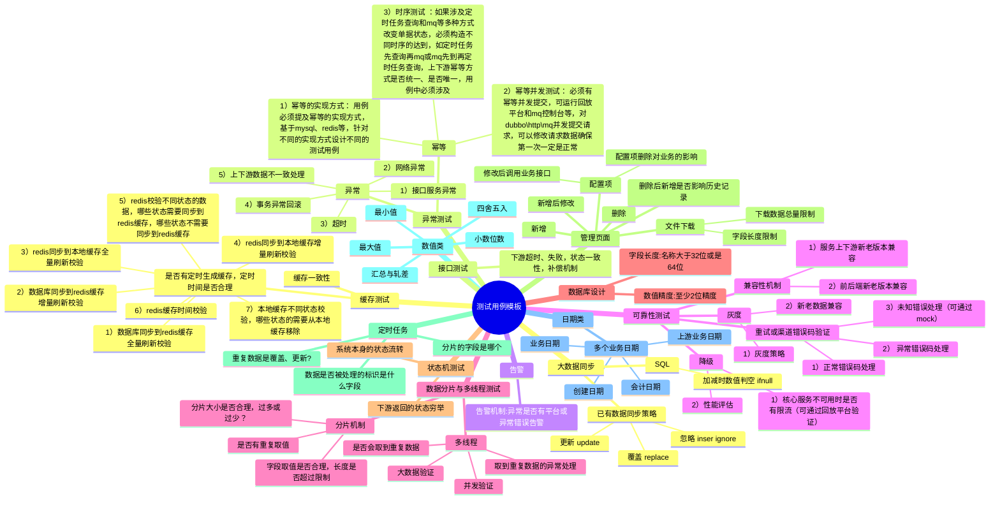

```mermaid
mindmap
  root((测试用例模板))
    缓存测试
      是否有定时生成缓存，定时时间是否合理
          1）数据库同步到redis缓存全量刷新校验
          2）数据库同步到redis缓存增量刷新校验
          3）redis同步到本地缓存全量刷新校验
          4）redis同步到本地缓存增量刷新校验
          5）redis校验不同状态的数据，哪些状态需要同步到redis缓存，哪些状态不需要同步到redis缓存
          6）redis缓存时间校验
          7）本地缓存不同状态校验，哪些状态的需要从本地缓存移除
      缓存一致性
    异常测试
      幂等
        1）幂等的实现方式： 用例必须提及幂等的实现方式，基于mysql、redis等，针对不同的实现方式设计不同的测试用例
        2）幂等并发测试： 必须有幂等并发提交，可运行回放平台和mq控制台等，对dubbo\http\mq并发提交请求，可以修改请求数据确保第一次一定是正常
        3）时序测试 ：如果涉及定时任务查询和mq等多种方式改变单据状态，必须构造不同时序的达到，如定时任务先查询再mq或mq先到再定时任务查询，上下游幂等方式是否统一、是否唯一，用例中必须涉及
      异常
        1）接口服务异常
        2）网络异常
        3）超时
        4）事务异常回滚
        5）上下游数据不一致处理
    告警
      告警机制:异常是否有平台或异常错误告警
    可靠性测试
      重试或渠道错误码验证
        1）正常错误码处理
        2） 异常错误码处理
        3）未知错误处理（可通过mock）
      兼容性机制
        1）服务上下游新老版本兼容
        2）前后端新老版本兼容
      降级
        1）核心服务不可用时是否有限流（可通过回放平台验证）
        2）性能评估
      灰度
        1）灰度策略
        2）新老数据兼容
    数据分片与多线程测试
      分片机制
        字段取值是否合理，长度是否超过限制
        是否有重复取值
        分片大小是否合理，过多或过少？
      多线程
        是否会取到重复数据
        取到重复数据的异常处理
        大数据验证
        并发验证
    数据库设计
      字段长度:名称大于32位或是64位
      数值精度:至少2位精度
    状态机测试
      下游返回的状态穷举
      系统本身的状态流转
    管理页面
      删除
      新增
      删除后新增是否影响历史记录
      新增后修改
      文件下载
        字段长度限制
        下载数据总量限制
      配置项
        配置项删除对业务的影响
        修改后调用业务接口
    定时任务
      重复数据是覆盖、更新?
      数据是否被处理的标识是什么字段
      分片的字段是哪个
    数值类
      最大值
      最小值
      小数位数
      四舍五入
      汇总与轧差
    日期类
      多个业务日期
       创建日期
       业务日期
       会计日期
       上游业务日期
    大数据同步
      已有数据同步策略
        忽略 inser ignore
        覆盖 replace
        更新 update
      SQL
       加减时数值判空 ifnull
    接口测试
      下游超时、失败，状态一致性，补偿机制
```